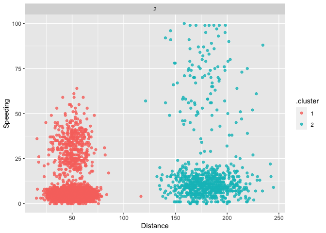
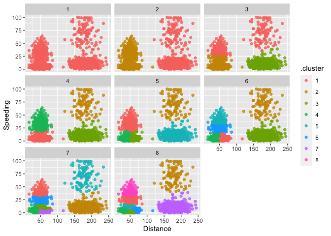
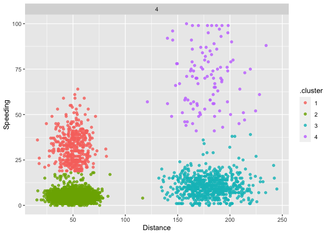

# Lucas de Paula

## Clustering Assignment

 

``` r
library(tidyverse)
library(tidymodels)

trucks = read.csv("data/trucks.csv")
```

 

# Task 1: Plot the relationship between Distance and Speeding. Describe this relationship. Does there appear to be any natural clustering of drivers?

 

It looks like there is a split into two main groups groups, but if we
look in more details the data can be separated into 4 groups as well.

-   Group 1 could be Distance from 0 to 100 and Speeding 0 to 25
-   Group 2 could be Distance from 0 to 100 and Speeding 25 to 75
-   Group 3 could be Distance from 100 to 250 and Speeding 0 to 25
-   Group 4 could be Distance from 100 to 250 and Speeding 25 to 100

 

``` r
ggplot(trucks, aes(Distance, Speeding)) + geom_point()
```

<!-- -->

 

# Task 2: As we did in the second clustering example, create a new data frame called “trucks\_cleaned” that contains the scaled and centered variables. Two notes:

## 1) The “predictor” variables in the recipe are “Distance” and “Speeding” and

## 2) There is no need to create dummy variables as there are no categorical variables inthe data.

 

``` r
kmeans_recipe = recipe(~ Distance + Speeding, trucks) 

truck_dummy = kmeans_recipe %>% 
  step_scale(all_numeric()) %>%
  step_center(all_numeric()) 

truck_dummy = prep(truck_dummy, trucks)

truck_cleaned = bake(truck_dummy, trucks)
```

 

# Task 3: Use k-Means clustering with two clusters (k=2) to cluster the “trucks\_cleaned” data frame. Use arandom number seed of 64. Use augment to add the resulting clusters object to the the “trucks” data frame. Design an appropriate visualization to visualize the clusters. Comment on the clusters.

The K-means algorithm generated two clusters mostly based out of the
Distance variable. Anything below \~123 is cluster 1, the remainder is
cluster 2.

 

``` r
set.seed(64)

clusts = 
  tibble(k = 2) %>%
  mutate(
    kclust = map(k, ~kmeans(truck_cleaned, .x)),
    tidied = map(kclust, tidy),
    glanced = map(kclust, glance),
    augmented = map(kclust, augment, trucks)
  )

clusters = 
  clusts %>%
  unnest(cols = c(tidied))

assignments = 
  clusts %>% 
  unnest(cols = c(augmented))

clusterings = 
  clusts %>%
  unnest(cols = c(glanced))

p1 = 
  ggplot(assignments, aes(x = Distance, y = Speeding)) +
  geom_point(aes(color = .cluster), alpha = 0.8) + 
  facet_wrap(~ k)
p1
```

<!-- -->

 

# Task 4: Create a visualization to show how the cluster appear from values of k from 1 to 8. Use a random number seed of 412. Which value of k appears to be most appropriate for this data?

 

It appears to me that based out of all clusters, I could use cluster 2
and 4 as those make more sense (visually) and it is easier to interpret.
However, the ultimate decision will come from the business area using
their knowledge to decide.

 

``` r
set.seed(412)

clusts = 
  tibble(k = 1:8) %>%
  mutate(
    kclust = map(k, ~kmeans(truck_cleaned, .x)),
    tidied = map(kclust, tidy),
    glanced = map(kclust, glance),
    augmented = map(kclust, augment, trucks)
  )

clusters = 
  clusts %>%
  unnest(cols = c(tidied))

assignments = 
  clusts %>% 
  unnest(cols = c(augmented))

clusterings = 
  clusts %>%
  unnest(cols = c(glanced))

p1 = 
  ggplot(assignments, aes(x = Distance, y = Speeding)) +
  geom_point(aes(color = .cluster), alpha = 0.8) + 
  facet_wrap(~ k)
p1
```

<!-- -->  

# Task 5: Create a plot of k versus within cluster sum of squares. Hint: We did this in the first clustering lecture. Which value of k appears to be best?

 

It looks like k = 4 would be the most appropriate as after that point
there isn’t a big change in sum of squares.

 

``` r
ggplot(clusterings, aes(k, tot.withinss)) +
  geom_line() +
  geom_point() + theme_bw()
```

<!-- -->

 

# Task 6: Repeat Task 3 for the number of clusters that you identifed in Task 5. Use the same random number seed as in Task 3. Don’t forget to include your visualization. Comment on the resulting clusters.

 

Using k = 4, as we identified in the previous step, we get a similar
split to Task 1’s initial observation. It could be possible that some
observations get wrongly grouped like the case of the two observations
between the clusters (2 and 4) or the observations that are close (3 and
4), however, it can also be helpful to use the expert’s insights to come
up with strategies to observations that are closely related to each
other.

 

``` r
set.seed(128)

clusts = 
  tibble(k = 4) %>%
  mutate(
    kclust = map(k, ~kmeans(truck_cleaned, .x)),
    tidied = map(kclust, tidy),
    glanced = map(kclust, glance),
    augmented = map(kclust, augment, trucks)
  )

clusters = 
  clusts %>%
  unnest(cols = c(tidied))

assignments = 
  clusts %>% 
  unnest(cols = c(augmented))

clusterings = 
  clusts %>%
  unnest(cols = c(glanced))

p1 = 
  ggplot(assignments, aes(x = Distance, y = Speeding)) +
  geom_point(aes(color = .cluster), alpha = 0.8) + 
  facet_wrap(~ k)
p1
```

<!-- -->
