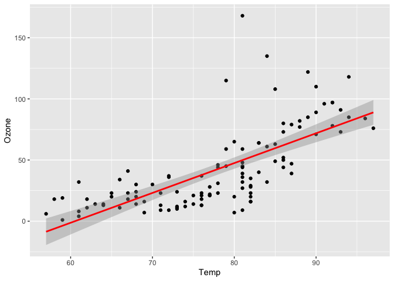

``` r
library("tidymodels")
library("tidyverse")
library("GGally")
library("lmtest")
```

``` r
air = airquality

summary(air)
```

    ##      Ozone           Solar.R           Wind             Temp      
    ##  Min.   :  1.00   Min.   :  7.0   Min.   : 1.700   Min.   :56.00  
    ##  1st Qu.: 18.00   1st Qu.:115.8   1st Qu.: 7.400   1st Qu.:72.00  
    ##  Median : 31.50   Median :205.0   Median : 9.700   Median :79.00  
    ##  Mean   : 42.13   Mean   :185.9   Mean   : 9.958   Mean   :77.88  
    ##  3rd Qu.: 63.25   3rd Qu.:258.8   3rd Qu.:11.500   3rd Qu.:85.00  
    ##  Max.   :168.00   Max.   :334.0   Max.   :20.700   Max.   :97.00  
    ##  NA's   :37       NA's   :7                                       
    ##      Month            Day      
    ##  Min.   :5.000   Min.   : 1.0  
    ##  1st Qu.:6.000   1st Qu.: 8.0  
    ##  Median :7.000   Median :16.0  
    ##  Mean   :6.993   Mean   :15.8  
    ##  3rd Qu.:8.000   3rd Qu.:23.0  
    ##  Max.   :9.000   Max.   :31.0  
    ## 

``` r
air2 = drop_na(data = air)
```

``` r
ggpairs(air2)
```

<!-- -->

``` r
ggcorr(air2, label = TRUE)
```

<!-- -->

``` r
ggplot(air2, aes(x = Temp, y = Ozone)) + geom_point()
```

<!-- -->

``` r
ozone_rcp = recipe(Ozone ~ Temp, air2)

lm_model = 
  linear_reg() %>% 
  set_engine("lm")

lm_wflow = 
  workflow() %>%
  add_model(lm_model) %>%
  add_recipe(ozone_rcp)

lm_fit2 =  fit(lm_wflow, air2)

summary(lm_fit2$fit$fit$fit)
```

    ## 
    ## Call:
    ## stats::lm(formula = ..y ~ ., data = data)
    ## 
    ## Residuals:
    ##     Min      1Q  Median      3Q     Max 
    ## -40.922 -17.459  -0.874  10.444 118.078 
    ## 
    ## Coefficients:
    ##              Estimate Std. Error t value Pr(>|t|)    
    ## (Intercept) -147.6461    18.7553  -7.872 2.76e-12 ***
    ## Temp           2.4391     0.2393  10.192  < 2e-16 ***
    ## ---
    ## Signif. codes:  0 '***' 0.001 '**' 0.01 '*' 0.05 '.' 0.1 ' ' 1
    ## 
    ## Residual standard error: 23.92 on 109 degrees of freedom
    ## Multiple R-squared:  0.488,  Adjusted R-squared:  0.4833 
    ## F-statistic: 103.9 on 1 and 109 DF,  p-value: < 2.2e-16

``` r
confint(lm_fit2$fit$fit$fit)
```

    ##                   2.5 %      97.5 %
    ## (Intercept) -184.818372 -110.473773
    ## Temp           1.964787    2.913433

``` r
ggplot(air2, aes(x = Temp, y = Ozone)) + 
  geom_point() +
  geom_smooth(method="lm", se = FALSE)
```

    ## `geom_smooth()` using formula 'y ~ x'

<!-- -->

``` r
# Prediction

testdata = data.frame(Temp = 80)
predict(lm_fit2, new_data = testdata)
```

    ## # A tibble: 1 x 1
    ##   .pred
    ##   <dbl>
    ## 1  47.5

``` r
# Correlation between predictor and response

ggplot(air2, aes(x = Temp, y = Ozone)) + geom_point() + geom_smooth(method = "lm", color = "red")
```

    ## `geom_smooth()` using formula 'y ~ x'

<!-- -->

``` r
# Are residuals independent?

dwtest(lm_fit2$fit$fit$fit)
```

    ## 
    ##  Durbin-Watson test
    ## 
    ## data:  lm_fit2$fit$fit$fit
    ## DW = 1.8644, p-value = 0.2123
    ## alternative hypothesis: true autocorrelation is greater than 0

``` r
# We fail to reject the null hypothesis with a p-value > 0.05. This suggests the residuals are likely independent.
```

``` r
# Model residuals exhibit constant variance?

air3 = air2 %>% mutate (resid1 = lm_fit2$fit$fit$fit$residuals)

ggplot(air3, aes(x=Temp, y = resid1))+ geom_point()
```

<!-- -->

``` r
# Is the residuals normal?

ggplot(air3,aes(x = resid1)) + geom_histogram()
```

    ## `stat_bin()` using `bins = 30`. Pick better value with `binwidth`.

<!-- -->

``` r
# The residuals are not normal
```
