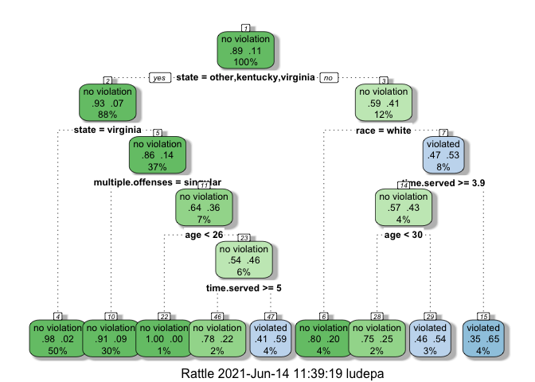
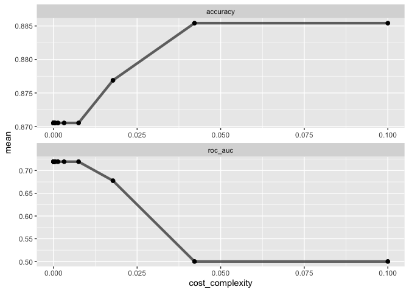
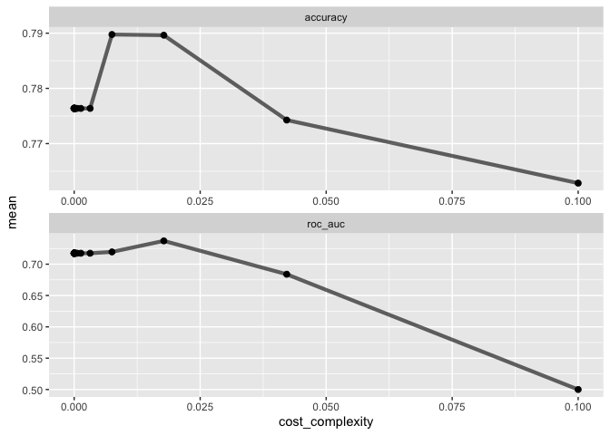
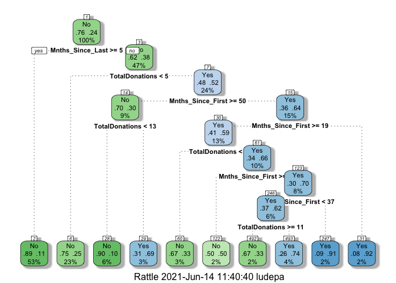

# Lucas de Paula

# Assignment 2 - Decision tree

``` r
library(tidyverse)
library(tidymodels)
library(caret)
library(rpart)
library(rpart.plot)
library(rattle)
library(RColorBrewer)
```

 

## Task 1:

### Split the data into training and testing sets. Your training set should have 70% of the data. Use a random number (set.seed) of 12345.

 

``` r
set.seed(12345) 

parole_split = initial_split(parole, prop = 0.7, strata = violator)

train = training(parole_split)
test = testing(parole_split)
```

 

## Task 2:

### Create a classification tree to predict “violator” in the training set (using all of the other variablesas predictors). Plot the tree. You do not need to tune the complexity parameter (i.e., it’s OK to allow R totry different cp values on its own).

 

``` r
parole_recipe = recipe(violator  ~., train)

tree_model = decision_tree() %>% 
  set_engine("rpart", model = TRUE) %>% 
  set_mode("classification")

parole_wflow = 
  workflow() %>% 
  add_model(tree_model) %>% 
  add_recipe(parole_recipe)

parole_fit = fit(parole_wflow, train)

tree = parole_fit %>% 
  pull_workflow_fit() %>% 
  pluck("fit")

fancyRpartPlot(tree, tweak=1.12)
```

<!-- -->

 

## Task 3:

### For the tree created in Task 2, how would you classify:

### - a 40 year-old parolee

### - from Louisiana

### - who served 5 years in prison,

### - with a sentence of 10 years,

### - committed multiple offenses?

### Describe how you “walk through” the classification tree to arrive at your answer.

 

I would classify this parolee as: violation. I start with the first
split and look at the rules we are trying to classify. I kept following
the splits until I reach a final classification, which in this case is
on node 15. For this assignment, because Race is not one of the values
we are using as input variable, I considered non-White for the 2 split.

 

## Task 4:

### Examine the complexity parameter (cp) values tried by R. Which cp value is optimal (recall that the optimal cp corresponds to the minimized “x error” value)? Is the tree from Task 2 associated with this optimal cp?

 

``` r
parole_fit$fit$fit$fit$cptable
```

    ##           CP nsplit rel error   xerror      xstd
    ## 1 0.03086420      0 1.0000000 1.000000 0.1280444
    ## 2 0.01851852      3 0.9074074 1.240741 0.1403860
    ## 3 0.01388889      4 0.8888889 1.277778 0.1421129
    ## 4 0.01000000      8 0.8333333 1.314815 0.1437987

 

The optimal CP is 0.10 and generated an XERROR of 1.314815. The
resulting tree contains 8 splits, which matches the resulting tree we
saw above.

 

## Task 5:

### Use a tuning grid (as we did in the Titanic problem) to try 25 different values for the complexityparameter (cp). R will select reasonable values. Use 5-fold k-fold cross-validation (don’t forget to set up yourfolds). Use a seed of 123 when setting up your folds.Use the code from the lecture to graphically examine model performance for the different values of cp.

### Hint: You can reuse the vast majority of the code that I provided for you. Be careful to change names andyou should be “good to go”. Note: This model took about two minutes to run on my computer. Your runtime will vary by your computational power :)

 

``` r
set.seed(123)

folds = vfold_cv(train, v = 5)

parole_recipe = recipe(violator ~., train) %>%
  step_dummy(all_nominal(),-all_outcomes())

tree_model = decision_tree(cost_complexity = tune()) %>% 
  set_engine("rpart", model = TRUE) %>% 
  set_mode("classification")

tree_grid = grid_regular(cost_complexity(),
                          levels = 25) 

parole_wflow = 
  workflow() %>% 
  add_model(tree_model) %>% 
  add_recipe(parole_recipe)

tree_res = 
  parole_wflow %>% 
  tune_grid(
    resamples = folds,
    grid = tree_grid
    )

tree_res
```

    ## # Tuning results
    ## # 5-fold cross-validation 
    ## # A tibble: 5 x 4
    ##   splits           id    .metrics          .notes          
    ##   <list>           <chr> <list>            <list>          
    ## 1 <split [376/95]> Fold1 <tibble [50 × 5]> <tibble [0 × 1]>
    ## 2 <split [377/94]> Fold2 <tibble [50 × 5]> <tibble [0 × 1]>
    ## 3 <split [377/94]> Fold3 <tibble [50 × 5]> <tibble [0 × 1]>
    ## 4 <split [377/94]> Fold4 <tibble [50 × 5]> <tibble [0 × 1]>
    ## 5 <split [377/94]> Fold5 <tibble [50 × 5]> <tibble [0 × 1]>

 

``` r
tree_res %>%
  collect_metrics() %>%
  ggplot(aes(cost_complexity, mean)) +
  geom_line(size = 1.5, alpha = 0.6) +
  geom_point(size = 2) +
  facet_wrap(~ .metric, scales = "free", nrow = 2) 
```

<!-- -->

``` r
best_tree = tree_res %>%
  select_best("accuracy")

best_tree
```

    ## # A tibble: 1 x 2
    ##   cost_complexity .config              
    ##             <dbl> <chr>                
    ## 1          0.0422 Preprocessor1_Model24

 

## Task 6:

### Which cp value yields the “optimal” accuracy value?

 

CP = 0.0421 yields the optimal accuracy value on Model24.

 

## Task 7:

### Try to plot the tree that corresponds to the cp value from Task 6. Don’t forget to finalize your workflow and generate your final fit before trying to plot.

 

``` r
final_wf = 
  parole_wflow %>% 
  finalize_workflow(best_tree)

final_fit = fit(final_wf, train)

tree = final_fit %>% 
  pull_workflow_fit() %>% 
  pluck("fit")

# fancyRpartPlot(tree, tweak = 1.5) 
```

 

## Task 8:

### What is the accuracy of the “root” that you generated in Task 7? Take your time and think about how to determine this value.

 

By definition the root tree will predict all observations to belong to
the majority class (no violation). This means that if we look at the
distribution of the class on the dataset (train). In our data set we
have 417 no violations and 54 violated. Which means that if we divide
417 by 471, we will get a value of 0.885. Thus, the accuracy of the
model will be 0.885. We can also see this by examining the final\_fit
variable.

 

``` r
final_fit
```

    ## ══ Workflow [trained] ══════════════════════════════════════════════════════════
    ## Preprocessor: Recipe
    ## Model: decision_tree()
    ## 
    ## ── Preprocessor ────────────────────────────────────────────────────────────────
    ## 1 Recipe Step
    ## 
    ## • step_dummy()
    ## 
    ## ── Model ───────────────────────────────────────────────────────────────────────
    ## n= 471 
    ## 
    ## node), split, n, loss, yval, (yprob)
    ##       * denotes terminal node
    ## 
    ## 1) root 471 54 no violation (0.8853503 0.1146497) *

 

## Task 9

### Read in the “Blood.csv” dataset. The dataset contains five variables:Mnths\_Since\_Last: Months since last donationTotalDonations: Total number of donationTotal\_Donated: Total amount of blood donatedMnths\_Since\_First: Months since first donationDonatedMarch: Binary variable representing whether he/she donated blood in March (1 = Yes, 0 = No)Convert the DonatedMarch variable to a factor and recode the variable so 0 = “No” and 1 = “Yes”.

 

``` r
blood = read.csv("data/Blood.csv")

blood = blood %>% 
        mutate(DonatedMarch = as_factor(DonatedMarch)) %>% 
        mutate(DonatedMarch = fct_recode(DonatedMarch, "No" = "0", "Yes" = "1" ))
```

 

## Task 9:

### Split the dataset into training (70%) and testing (30%) sets.You may wish to name your training and testing sets “train2” and “test2” as to not confuse them with the parole datsetsUse set.seed of 1234.

### Then develop a classification tree on the training set to predict “DonatedMarch”. Asyou did in Task 5, let R try 25 different values of cp. Don’t forget to create new folds on the new trainingdataset :) Use a seed of 1234 for the folds.Graphically examine how the relationship between cp values and accuracy. What cp value appears to be“optimal” to maximize accuracy?

 

``` r
set.seed(1234) 

blood_split = initial_split(blood, prop = 0.7, strata = DonatedMarch)

bl_train = training(blood_split)
bl_test = testing(blood_split)
```

 

``` r
set.seed(1234)

folds = vfold_cv(bl_train, v = 5)

blood_recipe = recipe(DonatedMarch ~., bl_train) %>%
  step_dummy(all_nominal(),-all_outcomes())

tree_model = decision_tree(cost_complexity = tune()) %>% 
  set_engine("rpart", model = TRUE) %>% 
  set_mode("classification")

tree_grid = grid_regular(cost_complexity(),
                          levels = 25) 

blood_wflow = 
  workflow() %>% 
  add_model(tree_model) %>% 
  add_recipe(blood_recipe)

tree_res = 
  blood_wflow %>% 
  tune_grid(
    resamples = folds,
    grid = tree_grid
    )

tree_res
```

    ## # Tuning results
    ## # 5-fold cross-validation 
    ## # A tibble: 5 x 4
    ##   splits            id    .metrics          .notes          
    ##   <list>            <chr> <list>            <list>          
    ## 1 <split [418/105]> Fold1 <tibble [50 × 5]> <tibble [0 × 1]>
    ## 2 <split [418/105]> Fold2 <tibble [50 × 5]> <tibble [0 × 1]>
    ## 3 <split [418/105]> Fold3 <tibble [50 × 5]> <tibble [0 × 1]>
    ## 4 <split [419/104]> Fold4 <tibble [50 × 5]> <tibble [0 × 1]>
    ## 5 <split [419/104]> Fold5 <tibble [50 × 5]> <tibble [0 × 1]>

``` r
tree_res %>%
  collect_metrics() %>%
  ggplot(aes(cost_complexity, mean)) +
  geom_line(size = 1.5, alpha = 0.6) +
  geom_point(size = 2) +
  facet_wrap(~ .metric, scales = "free", nrow = 2) 
```

<!-- -->

``` r
best_tree = tree_res %>%
  select_best("accuracy")

best_tree
```

    ## # A tibble: 1 x 2
    ##   cost_complexity .config              
    ##             <dbl> <chr>                
    ## 1         0.00750 Preprocessor1_Model22

 

If we consider accuracy alone, it looks like a CP value between 0.05 and
0.02 should maximize accuracy. But the AUC is maximized around 0.02. The
algorithm selects CP = 0.007498942, which based on the graphs, is
somewhere around where the accuracy reaches its peak.

 

``` r
final_wf = 
  blood_wflow %>% 
  finalize_workflow(best_tree)

final_fit = fit(final_wf, bl_train)

tree = final_fit %>% 
  pull_workflow_fit() %>% 
  pluck("fit")

fancyRpartPlot(tree, tweak = 1.5) 
```

<!-- -->

 

``` r
train_treepred = predict(final_fit, bl_train, type = "class")
confusionMatrix(train_treepred$.pred_class,bl_train$DonatedMarch,positive="Yes")
```

    ## Confusion Matrix and Statistics
    ## 
    ##           Reference
    ## Prediction  No Yes
    ##        No  386  75
    ##        Yes  13  49
    ##                                           
    ##                Accuracy : 0.8317          
    ##                  95% CI : (0.7969, 0.8628)
    ##     No Information Rate : 0.7629          
    ##     P-Value [Acc > NIR] : 7.816e-05       
    ##                                           
    ##                   Kappa : 0.4381          
    ##                                           
    ##  Mcnemar's Test P-Value : 7.893e-11       
    ##                                           
    ##             Sensitivity : 0.39516         
    ##             Specificity : 0.96742         
    ##          Pos Pred Value : 0.79032         
    ##          Neg Pred Value : 0.83731         
    ##              Prevalence : 0.23709         
    ##          Detection Rate : 0.09369         
    ##    Detection Prevalence : 0.11855         
    ##       Balanced Accuracy : 0.68129         
    ##                                           
    ##        'Positive' Class : Yes             
    ## 

 

``` r
test_treepred = predict(final_fit, bl_test, type = "class")
confusionMatrix(test_treepred$.pred_class,bl_test$DonatedMarch,positive="Yes")
```

    ## Confusion Matrix and Statistics
    ## 
    ##           Reference
    ## Prediction  No Yes
    ##        No  151  36
    ##        Yes  20  18
    ##                                           
    ##                Accuracy : 0.7511          
    ##                  95% CI : (0.6893, 0.8062)
    ##     No Information Rate : 0.76            
    ##     P-Value [Acc > NIR] : 0.65600         
    ##                                           
    ##                   Kappa : 0.2408          
    ##                                           
    ##  Mcnemar's Test P-Value : 0.04502         
    ##                                           
    ##             Sensitivity : 0.3333          
    ##             Specificity : 0.8830          
    ##          Pos Pred Value : 0.4737          
    ##          Neg Pred Value : 0.8075          
    ##              Prevalence : 0.2400          
    ##          Detection Rate : 0.0800          
    ##    Detection Prevalence : 0.1689          
    ##       Balanced Accuracy : 0.6082          
    ##                                           
    ##        'Positive' Class : Yes             
    ## 

 

As we can see, the accuracy of the model on the training dataset is
0.8317, and 0.7511 on the test dataset. There is a considerable
difference between the training and testing datasets, which could mean
our model is not generalizing well. In any case, if we classify
incorrectly in this case would be less tragic than the first example on
Parole. So if our model has an accuracy of 0.75, it is much better than
randomly predicting if someone will donate or not in March, meaning it
helps us have an idea on the expected number of donations.
