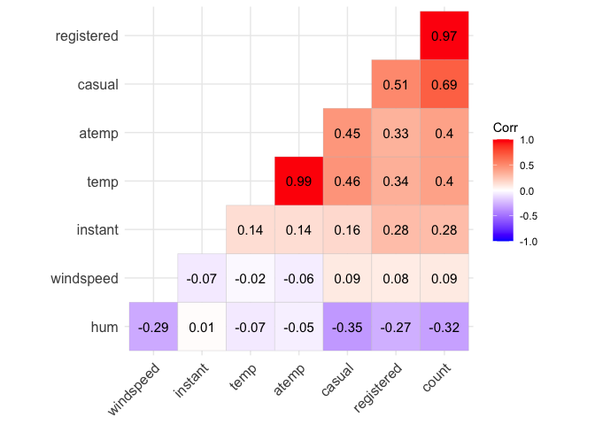
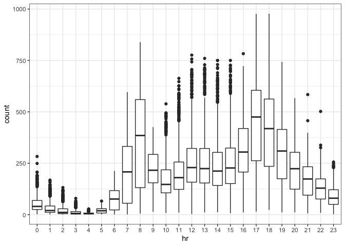
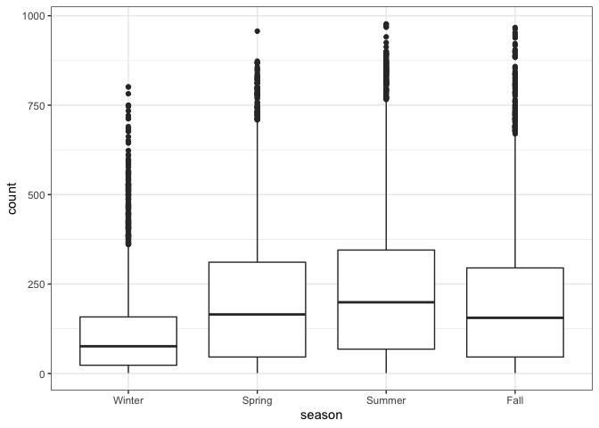
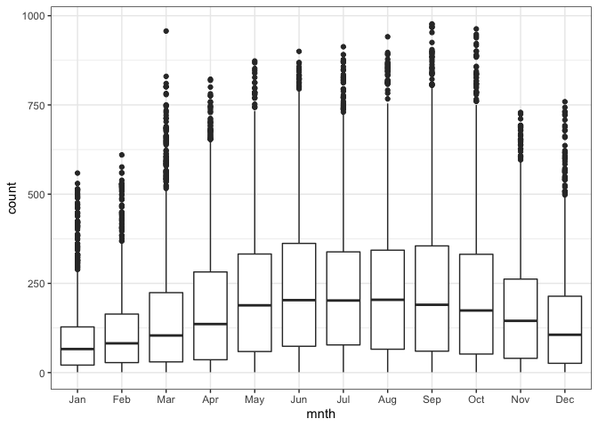
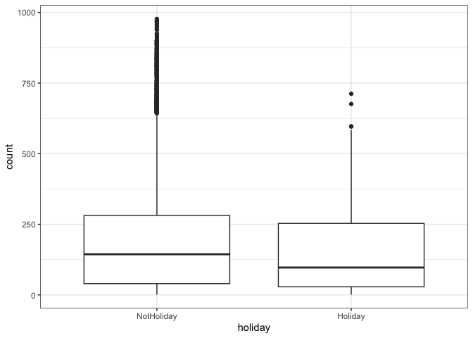
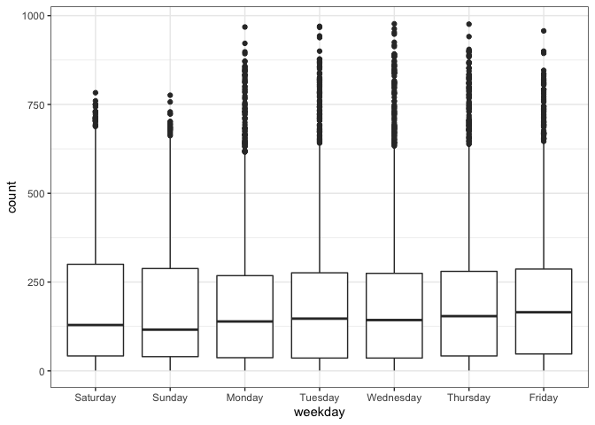
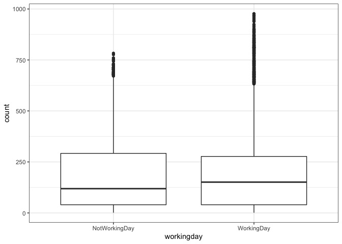
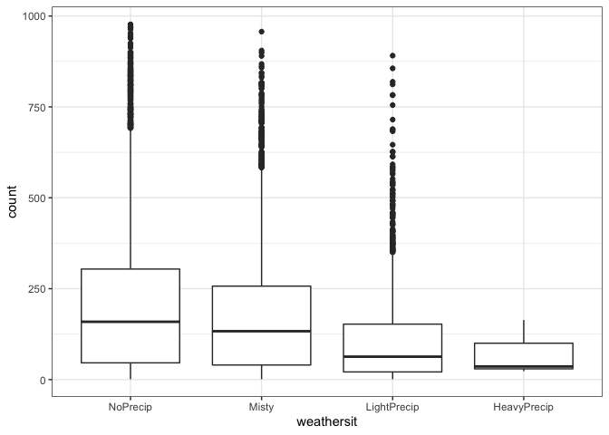

``` r
library(tidyverse)
library(tidymodels)
library(glmnet)
library(GGally)
library(ggcorrplot)
library(MASS)
library(car)
library(lubridate)
library(lmtest)
```

``` r
bike = read_csv("data/bike_cleaned.csv")
```

    ## 
    ## ── Column specification ────────────────────────────────────────────────────────
    ## cols(
    ##   instant = col_double(),
    ##   dteday = col_character(),
    ##   season = col_character(),
    ##   mnth = col_character(),
    ##   hr = col_double(),
    ##   holiday = col_character(),
    ##   weekday = col_character(),
    ##   workingday = col_character(),
    ##   weathersit = col_character(),
    ##   temp = col_double(),
    ##   atemp = col_double(),
    ##   hum = col_double(),
    ##   windspeed = col_double(),
    ##   casual = col_double(),
    ##   registered = col_double(),
    ##   count = col_double()
    ## )

``` r
bike = bike %>% mutate(dteday = mdy(dteday))

bike = bike %>% mutate_if(is.character, as_factor)

bike = bike %>% mutate(hr = as_factor(hr))
```

 

## Task 2: Which of the quantitative variables appears to be best correlated with “count” (ignore the “registered”and “casual” variable as the sum of these two variables equals “count”)?

 

``` r
# Select numeric columns to calculate correlation

num_cols = bike %>% 
  dplyr::select(c("instant","temp","atemp","hum","windspeed","casual","registered","count"))

corr = round(cor(num_cols), 2) #Note the ,1:11 code to select the columns for inclusion

ggcorrplot(corr, hc.order = TRUE, type = "lower", lab = TRUE)
```

<!-- -->

 

Based on the correlation plot above, count is positively strong
correlated with Registered and Casual.

 

## Task 3:We cannot use correlation to assess the relationship between a categorical predictor variable andour response variable. A good option is to visualize the relationship between the categorical and responsevariables via a boxplot (or similar visualization).

## Repeat this boxplot-based analysis for each of the categorical variables. Which variables appear to affect“count”? Provide a brief explanation as to why you believe that each variable does or does not affect “count”(use your intuition to help you answer this question).

 

``` r
ggplot(bike,aes(x=hr,y=count))+ geom_boxplot()+ theme_bw()
```

<!-- -->

``` r
ggplot(bike, aes(x = season , y = count)) + geom_boxplot() + theme_bw()
```

<!-- -->

``` r
ggplot(bike, aes(x = mnth , y = count)) + geom_boxplot() + theme_bw()
```

<!-- -->

``` r
ggplot(bike, aes(x = holiday , y = count)) + geom_boxplot() + theme_bw()
```

<!-- -->

``` r
ggplot(bike, aes(x = weekday , y = count)) + geom_boxplot() + theme_bw()
```

<!-- -->

``` r
ggplot(bike, aes(x = workingday , y = count)) + geom_boxplot() + theme_bw()
```

<!-- -->

``` r
ggplot(bike, aes(x = weathersit , y = count)) + geom_boxplot() + theme_bw()
```

<!-- -->  

Based on the graphs above, it looks like Count is affected by the
variables: mnth, holiday, workingday, weathersit.

Weathersit and mnth affecting Count more than the rest. My thought
process to affirm this is because there is a significant difference in
the distributions between these variables (amplitude and average of the
groups). The other variables either have a small impact or no impact in
the values of Count due to the same reason.

 

## Task 4 - As a baseline, choose the “best” variable from the correlation and visualization analysis above and build a model with that variable as the single predictor of “count”. Comment on the quality of the model.

 

``` r
# Building model to predict Count using Registered because it has the highest correlation with the dependent variable.

bike_rcp = recipe(count ~ registered , bike)

bike_model = 
  linear_reg() %>% 
  set_engine("lm")

bike_wflow = 
  workflow() %>% 
  add_model(bike_model) %>% 
  add_recipe(bike_rcp)

bike_fit = fit(bike_wflow, bike)

summary(bike_fit$fit$fit$fit)
```

    ## 
    ## Call:
    ## stats::lm(formula = ..y ~ ., data = data)
    ## 
    ## Residuals:
    ##      Min       1Q   Median       3Q      Max 
    ## -118.031  -16.264   -9.957    4.730  304.223 
    ## 
    ## Coefficients:
    ##              Estimate Std. Error t value Pr(>|t|)    
    ## (Intercept) 10.296458   0.459718    22.4   <2e-16 ***
    ## registered   1.165032   0.002131   546.8   <2e-16 ***
    ## ---
    ## Signif. codes:  0 '***' 0.001 '**' 0.01 '*' 0.05 '.' 0.1 ' ' 1
    ## 
    ## Residual standard error: 42.51 on 17377 degrees of freedom
    ## Multiple R-squared:  0.9451, Adjusted R-squared:  0.9451 
    ## F-statistic: 2.99e+05 on 1 and 17377 DF,  p-value: < 2.2e-16

 

The model has an R-square of 0.94 and the variable registered has a
slope of 1.16. Although the metrics look good, the interpretation of the
model itself doesn’t tell much as both variables have similar
interpretation: count depends on registered as registered means the
number of registered users, and count represents the number of rental
bikes.

 

## Task 5:Create a ridge regression model to predict the “count” variable. You should exclude the “instant”,“dteday”, “registered”, and “casual” variables (i.e., they should not be predictors). You may apply anyappropriate preprocessing steps. HINT: You can use “step\_rm” in the recipe to exclude variables from analyis. Select an appropriate value for lambda. Provide a brief commentary on the resulting model.

 

``` r
# Training model using Ridge regression

ridge_rcp = recipe(count ~ ., bike) %>% 
  step_rm("instant", "dteday", "registered", "casual") %>%
  step_dummy(all_nominal()) %>%
  step_center(all_predictors()) %>% 
  step_scale(all_predictors())
  
ridge_model = 
  linear_reg(mixture = 0, penalty = 0.1) %>% 
  set_engine("glmnet") 

ridge_wflow = 
  workflow() %>% 
  add_model(ridge_model) %>% 
  add_recipe(ridge_rcp)

ridge_fit = fit(ridge_wflow, bike)

ridge_fit %>%
  pull_workflow_fit() %>%
  pluck("fit")  
```

    ## 
    ## Call:  glmnet::glmnet(x = maybe_matrix(x), y = y, family = "gaussian",      alpha = ~0) 
    ## 
    ##     Df  %Dev Lambda
    ## 1   52  0.00  73420
    ## 2   52  0.56  66900
    ## 3   52  0.61  60950
    ## 4   52  0.67  55540
    ## 5   52  0.74  50600
    ## 6   52  0.81  46110
    ## 7   52  0.89  42010
    ## 8   52  0.97  38280
    ## 9   52  1.07  34880
    ## 10  52  1.17  31780
    ## 11  52  1.28  28960
    ## 12  52  1.40  26390
    ## 13  52  1.54  24040
    ## 14  52  1.68  21910
    ## 15  52  1.84  19960
    ## 16  52  2.01  18190
    ## 17  52  2.20  16570
    ## 18  52  2.41  15100
    ## 19  52  2.64  13760
    ## 20  52  2.88  12540
    ## 21  52  3.15  11420
    ## 22  52  3.44  10410
    ## 23  52  3.75   9482
    ## 24  52  4.10   8640
    ## 25  52  4.47   7872
    ## 26  52  4.87   7173
    ## 27  52  5.31   6536
    ## 28  52  5.78   5955
    ## 29  52  6.29   5426
    ## 30  52  6.83   4944
    ## 31  52  7.42   4505
    ## 32  52  8.06   4105
    ## 33  52  8.73   3740
    ## 34  52  9.46   3408
    ## 35  52 10.24   3105
    ## 36  52 11.07   2829
    ## 37  52 11.95   2578
    ## 38  52 12.88   2349
    ## 39  52 13.88   2140
    ## 40  52 14.92   1950
    ## 41  52 16.02   1777
    ## 42  52 17.18   1619
    ## 43  52 18.39   1475
    ## 44  52 19.65   1344
    ## 45  52 20.96   1225
    ## 46  52 22.32   1116
    ## 47  52 23.73   1017
    ## 48  52 25.17    926
    ## 49  52 26.65    844
    ## 50  52 28.16    769
    ## 51  52 29.70    701
    ## 52  52 31.25    639
    ## 53  52 32.82    582
    ## 54  52 34.39    530
    ## 55  52 35.96    483
    ## 56  52 37.51    440
    ## 57  52 39.06    401
    ## 58  52 40.57    365
    ## 59  52 42.06    333
    ## 60  52 43.50    303
    ## 61  52 44.90    276
    ## 62  52 46.25    252
    ## 63  52 47.55    230
    ## 64  52 48.78    209
    ## 65  52 49.95    190
    ## 66  52 51.06    174
    ## 67  52 52.10    158
    ## 68  52 53.07    144
    ## 69  52 53.97    131
    ## 70  52 54.80    120
    ## 71  52 55.57    109
    ## 72  52 56.28     99
    ## 73  52 56.92     91
    ## 74  52 57.50     82
    ## 75  52 58.03     75
    ## 76  52 58.51     68
    ## 77  52 58.94     62
    ## 78  52 59.33     57
    ## 79  52 59.68     52
    ## 80  52 60.00     47
    ## 81  52 60.28     43
    ## 82  52 60.53     39
    ## 83  52 60.76     36
    ## 84  52 60.96     33
    ## 85  52 61.15     30
    ## 86  52 61.31     27
    ## 87  52 61.47     25
    ## 88  52 61.61     22
    ## 89  52 61.73     20
    ## 90  52 61.85     19
    ## 91  52 61.96     17
    ## 92  52 62.06     15
    ## 93  52 62.16     14
    ## 94  52 62.24     13
    ## 95  52 62.33     12
    ## 96  52 62.41     11
    ## 97  52 62.48     10
    ## 98  52 62.54      9
    ## 99  52 62.61      8
    ## 100 52 62.67      7

 

``` r
ridge_fit %>%
  pull_workflow_fit() %>%
  pluck("fit")  %>% 
  coef(s = 15)
```

    ## 53 x 1 sparse Matrix of class "dgCMatrix"
    ##                                   1
    ## (Intercept)            189.46308763
    ## temp                    28.23848066
    ## atemp                   26.71704483
    ## hum                    -24.53649145
    ## windspeed               -3.02435740
    ## season_Spring            9.71954031
    ## season_Summer            3.20459711
    ## season_Fall             18.94219672
    ## mnth_Feb                -1.29512000
    ## mnth_Mar                 1.55404681
    ## mnth_Apr                 0.79080339
    ## mnth_May                 4.00061884
    ## mnth_Jun                -1.16493423
    ## mnth_Jul                -5.43457755
    ## mnth_Aug                 1.27763560
    ## mnth_Sep                 9.16683660
    ## mnth_Oct                 5.94893635
    ## mnth_Nov                 0.70580044
    ## mnth_Dec                 0.40286195
    ## hr_X1                  -17.76507017
    ## hr_X2                  -19.07524288
    ## hr_X3                  -20.59955441
    ## hr_X4                  -20.91166028
    ## hr_X5                  -18.18427959
    ## hr_X6                   -7.47133758
    ## hr_X7                   17.31625268
    ## hr_X8                   42.96892983
    ## hr_X9                   14.99222685
    ## hr_X10                   4.26427845
    ## hr_X11                   8.39877967
    ## hr_X12                  15.19270057
    ## hr_X13                  13.95003197
    ## hr_X14                  10.78847663
    ## hr_X15                  12.48274436
    ## hr_X16                  24.12369621
    ## hr_X17                  52.94110643
    ## hr_X18                  47.28017006
    ## hr_X19                  27.62580707
    ## hr_X20                  13.25047190
    ## hr_X21                   4.46726857
    ## hr_X22                  -2.09638014
    ## hr_X23                  -9.07643505
    ## holiday_Holiday         -4.32636873
    ## weekday_Sunday          -4.27873436
    ## weekday_Monday          -1.55800850
    ## weekday_Tuesday         -1.06453893
    ## weekday_Wednesday       -0.08336678
    ## weekday_Thursday        -0.54159117
    ## weekday_Friday           0.92494782
    ## workingday_WorkingDay   -0.15487196
    ## weathersit_Misty        -1.60566636
    ## weathersit_LightPrecip -14.15690164
    ## weathersit_HeavyPrecip  -0.28897094

 

The resulting ridge model has a R-Square of 0.62 where Lambda = 15 and
contains the predictors: weathersit, workingday, weekday, holiday, hr,
mnth, season, windspeed, temp, atemp, hum. All of the variables contain
a slop associated with them.

 

``` r
lasso_rcp = recipe(count ~., bike) %>% # add all variables via ~.
  step_rm("instant", "dteday", "registered", "casual") %>%
  step_dummy(all_nominal()) %>%
  step_center(all_predictors()) %>% # centers the predictors
  step_scale(all_predictors()) # scales the predictors
  
lasso_model = # give the model type a name 
  linear_reg(mixture = 1, penalty = 0.1) %>% # mixture = 0 sets up Ridge Regression
  set_engine("glmnet") # specify the specify type of linear tool we want to use 

lasso_wflow = 
  workflow() %>% 
  add_model(lasso_model) %>% 
  add_recipe(lasso_rcp)

lasso_fit = fit(lasso_wflow, bike)

lasso_fit %>%
  pull_workflow_fit() %>%
  pluck("fit")
```

    ## 
    ## Call:  glmnet::glmnet(x = maybe_matrix(x), y = y, family = "gaussian",      alpha = ~1) 
    ## 
    ##    Df  %Dev Lambda
    ## 1   0  0.00 73.420
    ## 2   1  2.78 66.900
    ## 3   1  5.09 60.950
    ## 4   3  7.60 55.540
    ## 5   3 11.69 50.600
    ## 6   4 15.44 46.110
    ## 7   4 19.18 42.010
    ## 8   6 22.56 38.280
    ## 9   6 26.23 34.880
    ## 10  6 29.28 31.780
    ## 11  8 32.06 28.960
    ## 12 11 34.97 26.390
    ## 13 12 38.11 24.040
    ## 14 12 40.86 21.910
    ## 15 13 43.19 19.960
    ## 16 14 45.32 18.190
    ## 17 15 47.30 16.570
    ## 18 15 49.05 15.100
    ## 19 16 50.59 13.760
    ## 20 17 51.90 12.540
    ## 21 18 53.13 11.420
    ## 22 18 54.16 10.410
    ## 23 19 55.02  9.482
    ## 24 22 55.90  8.640
    ## 25 23 56.68  7.872
    ## 26 25 57.37  7.173
    ## 27 26 58.00  6.536
    ## 28 27 58.56  5.955
    ## 29 27 59.04  5.426
    ## 30 30 59.47  4.944
    ## 31 31 59.86  4.505
    ## 32 32 60.19  4.105
    ## 33 32 60.51  3.740
    ## 34 33 60.79  3.408
    ## 35 33 61.02  3.105
    ## 36 33 61.20  2.829
    ## 37 34 61.37  2.578
    ## 38 37 61.65  2.349
    ## 39 37 61.86  2.140
    ## 40 37 62.03  1.950
    ## 41 38 62.16  1.777
    ## 42 38 62.27  1.619
    ## 43 38 62.37  1.475
    ## 44 41 62.46  1.344
    ## 45 41 62.58  1.225
    ## 46 42 62.67  1.116
    ## 47 42 62.76  1.017
    ## 48 41 62.81  0.926
    ## 49 42 62.86  0.844
    ## 50 43 62.90  0.769
    ## 51 43 62.94  0.701
    ## 52 44 62.97  0.639
    ## 53 43 63.01  0.582
    ## 54 44 63.03  0.530
    ## 55 44 63.05  0.483
    ## 56 43 63.07  0.440
    ## 57 44 63.09  0.401
    ## 58 46 63.11  0.365
    ## 59 47 63.13  0.333
    ## 60 48 63.14  0.303
    ## 61 48 63.15  0.276
    ## 62 48 63.16  0.252
    ## 63 48 63.17  0.230
    ## 64 48 63.18  0.209
    ## 65 48 63.19  0.190
    ## 66 48 63.19  0.174
    ## 67 49 63.20  0.158
    ## 68 49 63.20  0.144
    ## 69 49 63.20  0.131
    ## 70 51 63.21  0.120
    ## 71 51 63.21  0.109
    ## 72 51 63.21  0.099
    ## 73 51 63.21  0.091
    ## 74 51 63.22  0.082
    ## 75 51 63.22  0.075
    ## 76 51 63.22  0.068
    ## 77 51 63.22  0.062

 

``` r
lasso_fit %>%
  pull_workflow_fit() %>%
  pluck("fit")  %>% 
  coef(s = 0.530)
```

    ## 53 x 1 sparse Matrix of class "dgCMatrix"
    ##                                    1
    ## (Intercept)            189.463087634
    ## temp                    37.253493323
    ## atemp                   19.873539707
    ## hum                    -23.012905732
    ## windspeed               -4.227187689
    ## season_Spring           11.605932653
    ## season_Summer            3.429128753
    ## season_Fall             21.644398525
    ## mnth_Feb                -0.079071372
    ## mnth_Mar                 1.325520798
    ## mnth_Apr                 .          
    ## mnth_May                 2.225475093
    ## mnth_Jun                -2.121644046
    ## mnth_Jul                -6.353454614
    ## mnth_Aug                 .          
    ## mnth_Sep                 8.230137973
    ## mnth_Oct                 4.185934310
    ## mnth_Nov                -0.006836245
    ## mnth_Dec                 .          
    ## hr_X1                   -9.051021794
    ## hr_X2                  -10.526425793
    ## hr_X3                  -12.302027256
    ## hr_X4                  -12.628678680
    ## hr_X5                   -9.564046022
    ## hr_X6                    1.050879203
    ## hr_X7                   27.853942692
    ## hr_X8                   55.562556660
    ## hr_X9                   25.401696027
    ## hr_X10                  13.845051830
    ## hr_X11                  18.327467844
    ## hr_X12                  25.704338550
    ## hr_X13                  24.386615001
    ## hr_X14                  20.993407526
    ## hr_X15                  22.825402626
    ## hr_X16                  35.390036493
    ## hr_X17                  66.493105565
    ## hr_X18                  60.345300873
    ## hr_X19                  39.094950724
    ## hr_X20                  23.563558644
    ## hr_X21                  14.034968796
    ## hr_X22                   6.924507975
    ## hr_X23                   .          
    ## holiday_Holiday         -4.223166818
    ## weekday_Sunday          -3.669555296
    ## weekday_Monday          -0.924793371
    ## weekday_Tuesday         -0.420764712
    ## weekday_Wednesday        .          
    ## weekday_Thursday         .          
    ## weekday_Friday           0.823207569
    ## workingday_WorkingDay    .          
    ## weathersit_Misty        -1.711431502
    ## weathersit_LightPrecip -15.400227320
    ## weathersit_HeavyPrecip   .

 

The resulting ridge model has a R-Square of 0.6304 where Lambda = 0.530
and contains the predictors: weathersit, workingday, weekday, holiday,
hr, mnth, season, windspeed, temp, atemp, hum. Most of the variables
contain a slope associated with them. Some of them contain a 0 slope,
meaning that variable is not selected as a predictor.

 

## What are the implications of the model results from the ridge and lasso methods?

 

I have applied the same treatment for both models (ridge and lasso) and
used the same variables as predictors. However, because they both use
different logic behind the scenes, some of the variables (and levels)
will have a zero value associated with the slope. This means the
algorithm has dropped that variable (or level) from the model itself.
Both techniques will try to reduce model complexity and likelihood of
overfitting, but Lasso goes one step ahead and is able to remove a
variable from the model by using the value of the variable not the
square of it on the penalty calculation, thus the difference in results.

 
