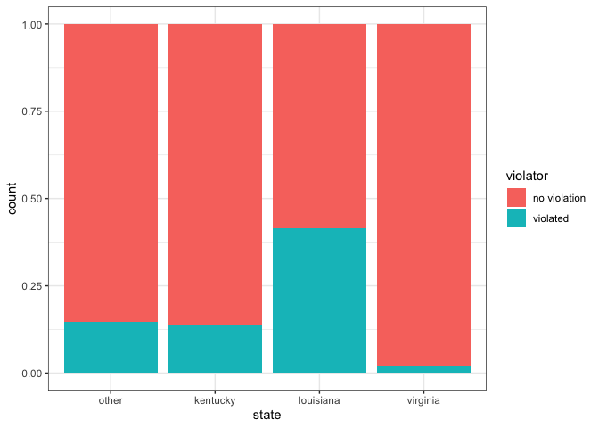
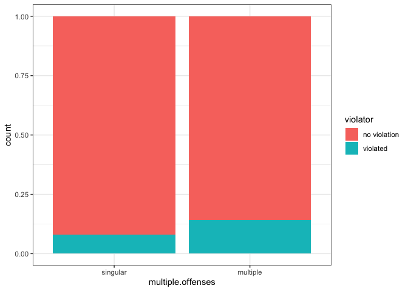
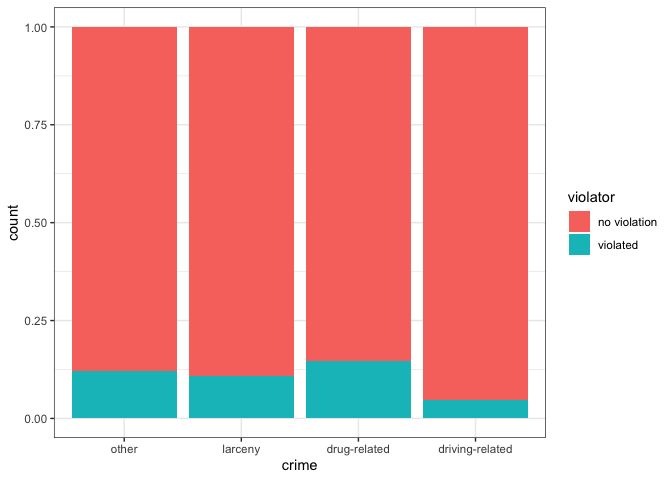
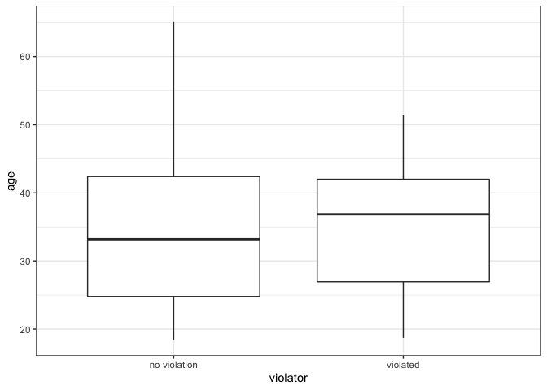
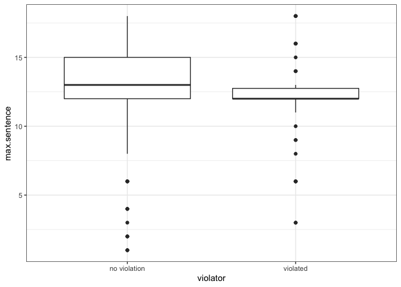
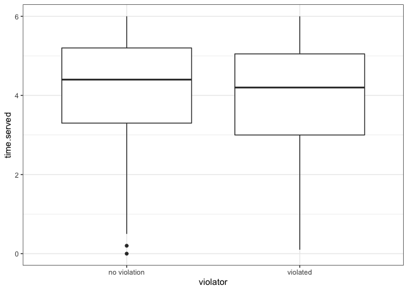
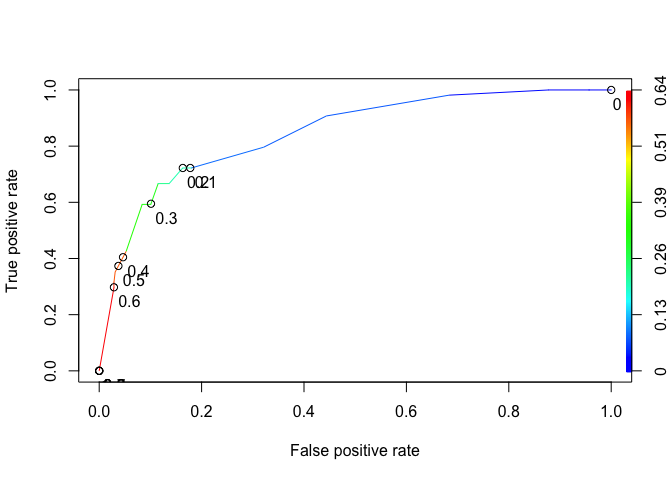

# Assignment 3

## Lucas de Paula

 

``` r
library(tidyverse)
library(tidymodels)
library(ROCR) 
library(GGally)
```

 

## Carefully convert the male, race, state, crime, multiple.offenses, and violator variables to factors.

## Recode (rename) the factor levels of each of these variables according to the description of the variables provided in the ParoleData.txt file (located with the assignment on Canvas).

 

``` r
parole = read.csv("data/parole.csv")

parole = parole %>% 
        mutate(male = as_factor(male),  
               race = as_factor(race),  
               state = as_factor(state),  
               crime = as_factor(crime),  
               multiple.offenses = as_factor(multiple.offenses),  
               violator = as_factor(violator) ) %>% 
        mutate(male = fct_recode(male, "male" = "1", "female" = "0" ),
              race = fct_recode(race, "white" = "1", "non-white" = "2" ),
              state = fct_recode(state, "other" = "1", "kentucky" = "2" , "louisiana" = "3", "virginia" = "4"  ),
              crime = fct_recode(crime, "larceny" = "2", "drug-related" = "3", "driving-related" = "4", "other" = "1"  ),
              multiple.offenses = fct_recode(multiple.offenses, "multiple" = "1", "singular" = "0" ),
              violator = fct_recode(violator, "violated" = "1", "no violation" = "0" ))
```

 

### Task 1: Split the data into training and testing sets. Your training set should have 70% of the data. Use arandom number (set.seed) of 12345. Be sure that the split is stratified by “violator”.

 

``` r
set.seed(12345)

parole_split = initial_split(parole, prop = 0.70, strata = violator)

train = training(parole_split)
test = testing(parole_split)
```

 

### Task 2: Our objective is to predict whether or not a parolee will violate his/her parole. In this task, use appropriate data visualizations and/or tables to identify which variables in the training set appear to be most predictive of the response variable “violator”. Provide a brief explanation of your thought process.

 

``` r
summary(train)
```

    ##      male            race          age              state      time.served   
    ##  female: 97   white    :269   Min.   :18.40   other    : 95   Min.   :0.000  
    ##  male  :374   non-white:202   1st Qu.:25.10   kentucky : 81   1st Qu.:3.300  
    ##                               Median :33.50   louisiana: 58   Median :4.400  
    ##                               Mean   :34.18   virginia :237   Mean   :4.184  
    ##                               3rd Qu.:42.40                   3rd Qu.:5.200  
    ##                               Max.   :65.10                   Max.   :6.000  
    ##   max.sentence   multiple.offenses             crime             violator  
    ##  Min.   : 1.00   singular:211      other          :230   no violation:417  
    ##  1st Qu.:12.00   multiple:260      larceny        : 74   violated    : 54  
    ##  Median :12.00                     drug-related   :102                     
    ##  Mean   :13.03                     driving-related: 65                     
    ##  3rd Qu.:15.00                                                             
    ##  Max.   :18.00

``` r
# ggpairs(train)
```

 

Based out of the overall correlation plots, it looks like the
categorical variables state, multiple.offenses and crime yield will help
us predict violator. Let’s check with the bar-charts.

 

``` r
ggplot(train, aes(x=state, fill = violator)) + geom_bar(position="fill") + theme_bw()
```

<!-- -->

``` r
ggplot(train, aes(x=multiple.offenses, fill = violator)) + geom_bar(position="fill") + theme_bw()
```

<!-- -->

``` r
ggplot(train, aes(x=crime, fill = violator)) + geom_bar(position="fill") + theme_bw()
```

<!-- -->

 

Based on our assumption, we can clearly see Louisiana has more violators
than any other state, and Virginia appears to have the least number of
violators.

 

Now let’s check the interval variables. It appears to me that
max.sentence and time.served will impact the violator predictions.

 

``` r
ggplot(train, aes(x=violator, y= age)) + geom_boxplot() + theme_bw()
```

<!-- -->

``` r
ggplot(train, aes(x=violator, y= max.sentence)) + geom_boxplot() + theme_bw()
```

<!-- -->

``` r
ggplot(train, aes(x=violator, y= time.served)) + geom_boxplot() + theme_bw()
```

<!-- -->
 

Again, our assumption is mostly right for max.sentence and time.served
as both variables have different means and distribution patterns.

 

Based on these variables, let’s create a model with the variable that
appears to have most impact on our predictor: state

 

## Task 3: Identify the variable from Task 2 that appears to you to be most predictive of “violator”. Create alogistic regression model using this variable to predict violator. Comment on the quality of the model.

 

### Model with State as independent variable

 

``` r
parole_model = 
  logistic_reg() %>%
  set_engine("glm")

parole_recipe = recipe(violator ~ state, train) %>%
  step_dummy(all_nominal(), -all_outcomes())

logreg_wf = workflow() %>%
  add_recipe(parole_recipe) %>% 
  add_model(parole_model)

parole_fit = fit(logreg_wf, train)

summary(parole_fit$fit$fit$fit)
```

    ## 
    ## Call:
    ## stats::glm(formula = ..y ~ ., family = stats::binomial, data = data)
    ## 
    ## Deviance Residuals: 
    ##     Min       1Q   Median       3Q      Max  
    ## -1.0335  -0.5403  -0.2065  -0.2065   2.7780  
    ## 
    ## Coefficients:
    ##                 Estimate Std. Error z value Pr(>|z|)    
    ## (Intercept)     -1.75539    0.28944  -6.065 1.32e-09 ***
    ## state_kentucky  -0.09521    0.43471  -0.219 0.826636    
    ## state_louisiana  1.40709    0.39351   3.576 0.000349 ***
    ## state_virginia  -2.08191    0.53672  -3.879 0.000105 ***
    ## ---
    ## Signif. codes:  0 '***' 0.001 '**' 0.01 '*' 0.05 '.' 0.1 ' ' 1
    ## 
    ## (Dispersion parameter for binomial family taken to be 1)
    ## 
    ##     Null deviance: 335.47  on 470  degrees of freedom
    ## Residual deviance: 270.95  on 467  degrees of freedom
    ## AIC: 278.95
    ## 
    ## Number of Fisher Scoring iterations: 6

 

## Task 4: Manually the best model you can to predict “violator”. Use only the training data set and use AIC to evaluate the “goodness” of the models. Comment on the quality of your final model. In particular, notewhich variables are significant and comment on how intuitive the model may (or may not) be.

 

### Model with State and Max.sentence as independent variables

 

``` r
parole_recipe1 = recipe(violator ~ state + max.sentence, train) %>%
  step_dummy(all_nominal(), -all_outcomes())

logreg_wf1 = workflow() %>%
  add_recipe(parole_recipe1) %>% 
  add_model(parole_model)

parole_fit1 = fit(logreg_wf1, train)

summary(parole_fit1$fit$fit$fit)
```

    ## 
    ## Call:
    ## stats::glm(formula = ..y ~ ., family = stats::binomial, data = data)
    ## 
    ## Deviance Residuals: 
    ##     Min       1Q   Median       3Q      Max  
    ## -1.1919  -0.5364  -0.2106  -0.2016   2.7795  
    ## 
    ## Coefficients:
    ##                 Estimate Std. Error z value Pr(>|z|)    
    ## (Intercept)     -2.35885    0.69752  -3.382 0.000720 ***
    ## max.sentence     0.04433    0.04604   0.963 0.335596    
    ## state_kentucky  -0.03926    0.43978  -0.089 0.928874    
    ## state_louisiana  1.59482    0.44206   3.608 0.000309 ***
    ## state_virginia  -2.10341    0.53725  -3.915 9.04e-05 ***
    ## ---
    ## Signif. codes:  0 '***' 0.001 '**' 0.01 '*' 0.05 '.' 0.1 ' ' 1
    ## 
    ## (Dispersion parameter for binomial family taken to be 1)
    ## 
    ##     Null deviance: 335.47  on 470  degrees of freedom
    ## Residual deviance: 270.02  on 466  degrees of freedom
    ## AIC: 280.02
    ## 
    ## Number of Fisher Scoring iterations: 6

 

### Model with State and Max.Sentence and Time.Served as independent variables

 

``` r
parole_recipe2 = recipe(violator ~ state + max.sentence + time.served, train) %>%
  step_dummy(all_nominal(), -all_outcomes())

logreg_wf2 = workflow() %>%
  add_recipe(parole_recipe2) %>% 
  add_model(parole_model)

parole_fit2 = fit(logreg_wf2, train)

summary(parole_fit2$fit$fit$fit)
```

    ## 
    ## Call:
    ## stats::glm(formula = ..y ~ ., family = stats::binomial, data = data)
    ## 
    ## Deviance Residuals: 
    ##     Min       1Q   Median       3Q      Max  
    ## -1.2575  -0.5356  -0.2116  -0.2036   2.7759  
    ## 
    ## Coefficients:
    ##                   Estimate Std. Error z value Pr(>|z|)    
    ## (Intercept)     -2.042e+00  8.502e-01  -2.402 0.016299 *  
    ## max.sentence     4.230e-02  4.622e-02   0.915 0.359999    
    ## time.served     -6.969e-02  1.080e-01  -0.645 0.518789    
    ## state_kentucky   7.931e-05  4.449e-01   0.000 0.999858    
    ## state_louisiana  1.544e+00  4.498e-01   3.433 0.000597 ***
    ## state_virginia  -2.102e+00  5.373e-01  -3.913 9.11e-05 ***
    ## ---
    ## Signif. codes:  0 '***' 0.001 '**' 0.01 '*' 0.05 '.' 0.1 ' ' 1
    ## 
    ## (Dispersion parameter for binomial family taken to be 1)
    ## 
    ##     Null deviance: 335.47  on 470  degrees of freedom
    ## Residual deviance: 269.60  on 465  degrees of freedom
    ## AIC: 281.6
    ## 
    ## Number of Fisher Scoring iterations: 6

 

### Model with State, Max.Sentence, Time.Served and Crime as independent variables

 

``` r
parole_recipe3 = recipe(violator ~ state + max.sentence + time.served + crime, train) %>%
  step_dummy(all_nominal(), -all_outcomes())

logreg_wf3 = workflow() %>%
  add_recipe(parole_recipe3) %>% 
  add_model(parole_model)

parole_fit3 = fit(logreg_wf3, train)

summary(parole_fit3$fit$fit$fit)
```

    ## 
    ## Call:
    ## stats::glm(formula = ..y ~ ., family = stats::binomial, data = data)
    ## 
    ## Deviance Residuals: 
    ##     Min       1Q   Median       3Q      Max  
    ## -1.2800  -0.5346  -0.2234  -0.1977   3.0727  
    ## 
    ## Coefficients:
    ##                       Estimate Std. Error z value Pr(>|z|)    
    ## (Intercept)           -1.79361    0.87173  -2.058  0.03964 *  
    ## max.sentence           0.04202    0.04760   0.883  0.37734    
    ## time.served           -0.08936    0.10862  -0.823  0.41072    
    ## state_kentucky        -0.11487    0.45991  -0.250  0.80277    
    ## state_louisiana        1.39983    0.45042   3.108  0.00188 ** 
    ## state_virginia        -2.26727    0.55128  -4.113 3.91e-05 ***
    ## crime_larceny          0.38675    0.48756   0.793  0.42764    
    ## crime_drug.related    -0.10113    0.38284  -0.264  0.79166    
    ## crime_driving.related -0.94788    0.65757  -1.441  0.14944    
    ## ---
    ## Signif. codes:  0 '***' 0.001 '**' 0.01 '*' 0.05 '.' 0.1 ' ' 1
    ## 
    ## (Dispersion parameter for binomial family taken to be 1)
    ## 
    ##     Null deviance: 335.47  on 470  degrees of freedom
    ## Residual deviance: 265.99  on 462  degrees of freedom
    ## AIC: 283.99
    ## 
    ## Number of Fisher Scoring iterations: 6

 

### Model with State, Max.Sentence, Time.Served, Crime and multiple.offenses as independent variables

 

``` r
parole_recipe4 = recipe(violator ~ state + max.sentence + time.served + crime + multiple.offenses, train) %>%
  step_dummy(all_nominal(), -all_outcomes())

logreg_wf4 = workflow() %>%
  add_recipe(parole_recipe4) %>% 
  add_model(parole_model)

parole_fit4 = fit(logreg_wf4, train)

summary(parole_fit4$fit$fit$fit)
```

    ## 
    ## Call:
    ## stats::glm(formula = ..y ~ ., family = stats::binomial, data = data)
    ## 
    ## Deviance Residuals: 
    ##     Min       1Q   Median       3Q      Max  
    ## -1.4931  -0.4488  -0.2375  -0.1529   2.9327  
    ## 
    ## Coefficients:
    ##                            Estimate Std. Error z value Pr(>|z|)    
    ## (Intercept)                -2.75668    0.97013  -2.842  0.00449 ** 
    ## max.sentence                0.06272    0.05116   1.226  0.22019    
    ## time.served                -0.06993    0.11549  -0.606  0.54481    
    ## state_kentucky              0.16665    0.48793   0.342  0.73269    
    ## state_louisiana             0.90318    0.48564   1.860  0.06292 .  
    ## state_virginia             -3.07200    0.58736  -5.230 1.69e-07 ***
    ## crime_larceny               0.35112    0.50228   0.699  0.48452    
    ## crime_drug.related         -0.07373    0.40541  -0.182  0.85569    
    ## crime_driving.related      -0.76033    0.67179  -1.132  0.25772    
    ## multiple.offenses_multiple  1.59239    0.39090   4.074 4.63e-05 ***
    ## ---
    ## Signif. codes:  0 '***' 0.001 '**' 0.01 '*' 0.05 '.' 0.1 ' ' 1
    ## 
    ## (Dispersion parameter for binomial family taken to be 1)
    ## 
    ##     Null deviance: 335.47  on 470  degrees of freedom
    ## Residual deviance: 248.47  on 461  degrees of freedom
    ## AIC: 268.47
    ## 
    ## Number of Fisher Scoring iterations: 6

 

As we can see from the experiments above, the best model, based on AIC
metric, is the one with State, Max.Sentence, Time.Served, and Crime as
independent variables - with AIC = 294.28. If we add another variable:
multiple.offenses, it drops significantly to 279.82. The impressive
thing about the champion model is that only the state variable is
significant in the model, where the state of Virginia impacts the
prediction negatively and Louisiana impacts it positively. Out of all
the models, the champion model is the simplest model of all, but at the
same time, is very dependent on the variable state, which might not be a
good thing.

 

## Task 5: Create a logistic regression model using the training set to predict “violator” using the variables:state, multiple.offenses, and race. Comment on the quality of this model. Be sure to note which variables are significant.

 

``` r
parole_model5 = 
  logistic_reg() %>%
  set_engine("glm")

parole_recipe5 = recipe(violator ~ state + multiple.offenses + race, train) %>%
  step_dummy(all_nominal(), -all_outcomes())

logreg_wf5 = workflow() %>%
  add_recipe(parole_recipe5) %>% 
  add_model(parole_model5)

parole_fit5 = fit(logreg_wf5, train)

summary(parole_fit5$fit$fit$fit)
```

    ## 
    ## Call:
    ## stats::glm(formula = ..y ~ ., family = stats::binomial, data = data)
    ## 
    ## Deviance Residuals: 
    ##     Min       1Q   Median       3Q      Max  
    ## -1.3572  -0.4013  -0.2705  -0.1557   2.9726  
    ## 
    ## Coefficients:
    ##                            Estimate Std. Error z value Pr(>|z|)    
    ## (Intercept)                -2.47873    0.36085  -6.869 6.46e-12 ***
    ## state_kentucky             -0.01418    0.46926  -0.030  0.97590    
    ## state_louisiana             0.11876    0.49950   0.238  0.81206    
    ## state_virginia             -3.58422    0.63848  -5.614 1.98e-08 ***
    ## multiple.offenses_multiple  1.65689    0.39652   4.179 2.93e-05 ***
    ## race_non.white              1.11646    0.39092   2.856  0.00429 ** 
    ## ---
    ## Signif. codes:  0 '***' 0.001 '**' 0.01 '*' 0.05 '.' 0.1 ' ' 1
    ## 
    ## (Dispersion parameter for binomial family taken to be 1)
    ## 
    ##     Null deviance: 335.47  on 470  degrees of freedom
    ## Residual deviance: 244.52  on 465  degrees of freedom
    ## AIC: 256.52
    ## 
    ## Number of Fisher Scoring iterations: 6

 

Out of all the models built so far, this is the one that performs the
worst with an AIC of 269.04. The significant variables are: intercept,
state\_virginia, multiple offenses, race\_non.white.

 

## Task 6: What is the predicted probability of parole violation of the two following parolees?

## Parolee1:Louisiana with multiple offenses and white race

## Parolee2: Kentucky with no multiple offenses and other race

 

``` r
parolee1 = data.frame(state = "louisiana", multiple.offenses = "multiple", race = "white")

pred1 = predict(parole_fit5, parolee1, type="prob")

parolee2 = data.frame(state = "kentucky", multiple.offenses = "singular", race = "non-white")

pred2 = predict(parole_fit5, parolee2, type="prob")

pred1
```

    ## # A tibble: 1 x 2
    ##   `.pred_no violation` .pred_violated
    ##                  <dbl>          <dbl>
    ## 1                0.669          0.331

``` r
pred2
```

    ## # A tibble: 1 x 2
    ##   `.pred_no violation` .pred_violated
    ##                  <dbl>          <dbl>
    ## 1                0.798          0.202

 

The predicted probability of parole violation for parolee1 is 0.3311299
and for parolee2 is 0.2015788

 

## Task 7: Develop an ROC curve and determine the probability threshold that best balances specificity andsensitivity (on the training set).

 

``` r
predictions = predict(parole_fit5, train, type="prob")[2]
head(predictions)
```

    ## # A tibble: 6 x 1
    ##   .pred_violated
    ##            <dbl>
    ## 1         0.0774
    ## 2         0.204 
    ## 3         0.204 
    ## 4         0.0774
    ## 5         0.0774
    ## 6         0.204

``` r
ROCRpred = prediction(predictions, train$violator) 

ROCRperf = performance(ROCRpred, "tpr", "fpr")
plot(ROCRperf, colorize=TRUE, print.cutoffs.at=seq(0,1,by=0.1), text.adj=c(-0.2,1.7))
```

<!-- -->

``` r
opt.cut = function(perf, pred){
    cut.ind = mapply(FUN=function(x, y, p){
        d = (x - 0)^2 + (y-1)^2
        ind = which(d == min(d))
        c(sensitivity = y[[ind]], specificity = 1-x[[ind]], 
            cutoff = p[[ind]])
    }, perf@x.values, perf@y.values, pred@cutoffs)
}
print(opt.cut(ROCRperf, ROCRpred))
```

    ##                  [,1]
    ## sensitivity 0.7222222
    ## specificity 0.8369305
    ## cutoff      0.2015788

 

Based on the code above, the best cutoff value would be 0.12, which
would give us a specificity of 0.82 and a sensitiity of 0.75.

 

## Task 8: What is the accuracy, sensitivity, and specificity of the model on the training set given the cutoff from Task 7? What are the implications of incorrectly classifying a parolee?

 

``` r
t1 = table(train$violator,predictions > 0.1295001)

t1
```

    ##               
    ##                FALSE TRUE
    ##   no violation   349   68
    ##   violated        15   39

``` r
acc = (t1[1,1]+t1[2,2])/nrow(train)
sen = t1[2,2] / (t1[2,2] + t1[2,1])
spc = t1[1,1] / (t1[1,1] + t1[1,2])
```

 

The accuracy of the model with cutoff = 0.1295001 is 0.8237792, the
sensitivity of the model is 0.7222222 and the specificity is 0.8369305.
If the model incorrectly classifies parole, it will have profound
impacts on society as a non-guilty citizen can may be put in prison, or
a guilty citizen may be set free in society.

 

## Task 9: Identify a probability threshold (via trial-and-error) that best maximizes accuracy on the trainingset.

 

``` r
print("Tentative 1 - probability threshold = 0.5")
```

    ## [1] "Tentative 1 - probability threshold = 0.5"

``` r
t1 = table(train$violator,predictions > 0.5)
t1
```

    ##               
    ##                FALSE TRUE
    ##   no violation   404   13
    ##   violated        35   19

``` r
(t1[1,1]+t1[2,2])/nrow(train)
```

    ## [1] 0.8980892

``` r
print("Tentative 2 - probability threshold = 0.6")
```

    ## [1] "Tentative 2 - probability threshold = 0.6"

``` r
t2 = table(train$violator,predictions > 0.6)
t2
```

    ##               
    ##                FALSE TRUE
    ##   no violation   405   12
    ##   violated        38   16

``` r
(t2[1,1]+t2[2,2])/nrow(train)
```

    ## [1] 0.8938429

``` r
print("Tentative 3 - probability threshold = 1")
```

    ## [1] "Tentative 3 - probability threshold = 1"

``` r
t3 = table(train$violator,predictions > 1)
t3
```

    ##               
    ##                FALSE
    ##   no violation   417
    ##   violated        54

``` r
(t3[1])/nrow(train)
```

    ## [1] 0.8853503

 

Apparently, a threshold of 0.5 will get the model the highest accuracy,
0.8990.

 

## Task 10: Use your probability threshold from Task 9 to determine accuracy of the model on the testing set.

 

``` r
predictions_test = predict(parole_fit5, test, type="prob")[2]
head(predictions_test)
```

    ## # A tibble: 6 x 1
    ##   .pred_violated
    ##            <dbl>
    ## 1         0.0774
    ## 2         0.0774
    ## 3         0.204 
    ## 4         0.0774
    ## 5         0.573 
    ## 6         0.204

``` r
test_pred = table(test$violator,predictions_test > 0.5)
test_pred
```

    ##               
    ##                FALSE TRUE
    ##   no violation   175    5
    ##   violated        16    8

``` r
acc_test = (test_pred[1,1]+test_pred[2,2])/nrow(test)
```

 

The accuracy of the model for the testing dataset is 0.8970588

 
