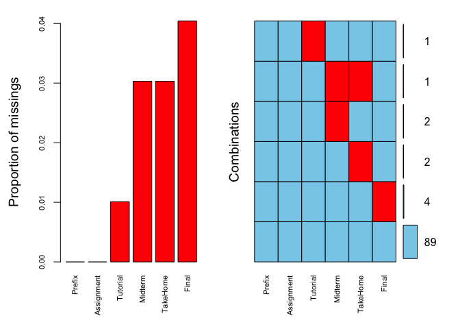

 

# Lucas de Paula

# Module 4 Assignment 1

 

``` r
library(tidyverse)
library(mice)
library(skimr)
library(VIM)
```

``` r
grades = read.csv("data/class-grades.csv")
```

 

The dataset was originally used to investigate how student performance
in the course would be predictive of student grades on the “Final” exam.
The “Prefix” column is a surrogate for enrollment year in the
engineering program. Smaller values imply older (more mature?) students.

 

# Task 1

## For which variables is there missing data?

 

``` r
skim(grades)
```

|                                                  |        |
|:-------------------------------------------------|:-------|
| Name                                             | grades |
| Number of rows                                   | 99     |
| Number of columns                                | 6      |
| \_\_\_\_\_\_\_\_\_\_\_\_\_\_\_\_\_\_\_\_\_\_\_   |        |
| Column type frequency:                           |        |
| numeric                                          | 6      |
| \_\_\_\_\_\_\_\_\_\_\_\_\_\_\_\_\_\_\_\_\_\_\_\_ |        |
| Group variables                                  | None   |

Data summary

**Variable type: numeric**

| skim\_variable | n\_missing | complete\_rate |  mean |    sd |    p0 |   p25 |   p50 |    p75 |   p100 | hist  |
|:---------------|-----------:|---------------:|------:|------:|------:|------:|------:|-------:|-------:|:------|
| Prefix         |          0 |           1.00 |  7.31 |  0.93 |  4.00 |  7.00 |  8.00 |   8.00 |   8.00 | ▁▁▁▅▇ |
| Assignment     |          0 |           1.00 | 85.49 | 12.60 | 28.14 | 80.88 | 89.94 |  95.00 | 100.83 | ▁▁▁▅▇ |
| Tutorial       |          1 |           0.99 | 89.79 | 15.14 | 34.09 | 83.93 | 93.37 | 100.56 | 112.58 | ▁▂▁▇▆ |
| Midterm        |          3 |           0.97 | 67.70 | 19.43 | 28.12 | 52.50 | 69.38 |  81.56 | 110.00 | ▃▅▇▅▂ |
| TakeHome       |          3 |           0.97 | 81.12 | 23.95 | 16.91 | 69.90 | 88.42 |  99.07 | 108.89 | ▁▁▂▅▇ |
| Final          |          4 |           0.96 | 68.23 | 18.82 | 28.06 | 52.92 | 66.11 |  83.61 | 108.89 | ▂▇▇▇▂ |

 

As we can see above, the variables Tutorial, Midterm, TakeHome and Final
have missing values.

 

# Task 2:

## Use the VIM package to visualize missingness. Are there any students that are missing multiple pieces of data?

 

``` r
vim_plot = aggr(grades, numbers = TRUE, prop = c(TRUE, FALSE), cex.axis=.7)
```

<!-- -->

 

Yes, there is one student that has TakeHome and Midterm containing
missing values.

 

# Task 3:

## Use row-wise deletion of missing values to create a new data frame. How many rows remain in this data frame?

 

``` r
rowwise_grades = grades %>% drop_na() 

nrow(rowwise_grades)
```

    ## [1] 89

 

There are 89 observations on the newly created data frame.

 

# Task 4:

## Use column-wise deletion of missing values to create a new data frame (from the original dataframe not from the data frame created in Task 3).

## How many columns remain in this data frame?

 

``` r
colwise_grades = grades %>% select(-Tutorial, -Midterm, -TakeHome, -Final)

ncol(colwise_grades)
```

    ## [1] 2

 

There are only two columns left.

 

# Task 5:

## Which approach (Task 3 or Task 4) seems preferable for this dataset? Briefly discuss your answer.

 

I’d say the first approach (row-wise deletion) makes more sense as we
are losing much less information during the selection. Although we lose
10 rows of data, it means minimal loss of information when compared to
losing 4 out of 6 columns.

 

# Task 6:

## Use the “mice” package to impute the missing data in this dataset. Set “m = 5” and “method=”pmm"" in the imputation.

## You MUST use a random number seed of 123 for this imputation.

## What is the mean value for the “Final” variable after imputation?

 

``` r
set.seed(123) 

imp_grades = mice(grades, m=5, method='pmm', printFlag=FALSE)

summary(imp_grades)
```

    ## Class: mids
    ## Number of multiple imputations:  5 
    ## Imputation methods:
    ##     Prefix Assignment   Tutorial    Midterm   TakeHome      Final 
    ##         ""         ""      "pmm"      "pmm"      "pmm"      "pmm" 
    ## PredictorMatrix:
    ##            Prefix Assignment Tutorial Midterm TakeHome Final
    ## Prefix          0          1        1       1        1     1
    ## Assignment      1          0        1       1        1     1
    ## Tutorial        1          1        0       1        1     1
    ## Midterm         1          1        1       0        1     1
    ## TakeHome        1          1        1       1        0     1
    ## Final           1          1        1       1        1     0

``` r
grades_complete = complete(imp_grades) 

summary(grades_complete)
```

    ##      Prefix        Assignment        Tutorial         Midterm      
    ##  Min.   :4.000   Min.   : 28.14   Min.   : 34.09   Min.   : 28.12  
    ##  1st Qu.:7.000   1st Qu.: 80.88   1st Qu.: 84.69   1st Qu.: 52.81  
    ##  Median :8.000   Median : 89.94   Median : 93.10   Median : 70.00  
    ##  Mean   :7.313   Mean   : 85.49   Mean   : 89.76   Mean   : 68.31  
    ##  3rd Qu.:8.000   3rd Qu.: 95.00   3rd Qu.:100.55   3rd Qu.: 82.81  
    ##  Max.   :8.000   Max.   :100.83   Max.   :112.58   Max.   :110.00  
    ##     TakeHome          Final       
    ##  Min.   : 16.91   Min.   : 28.06  
    ##  1st Qu.: 67.96   1st Qu.: 53.33  
    ##  Median : 88.89   Median : 66.11  
    ##  Mean   : 80.80   Mean   : 68.33  
    ##  3rd Qu.: 99.07   3rd Qu.: 83.61  
    ##  Max.   :108.89   Max.   :108.89

 

The mean value for the Final variable after imputation is 68.33.

 
