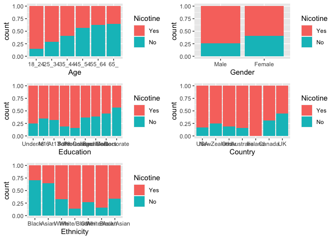
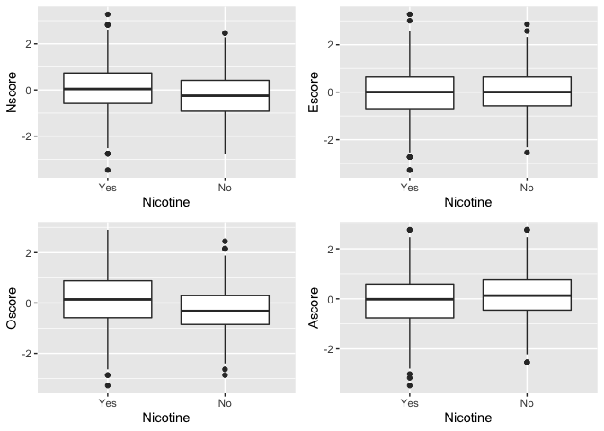
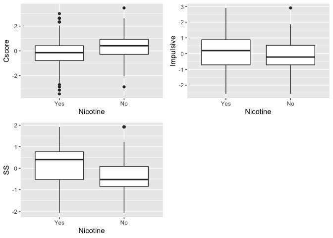
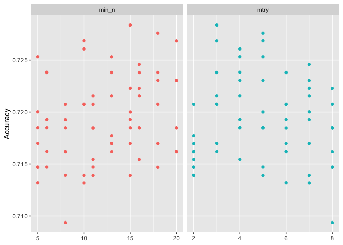
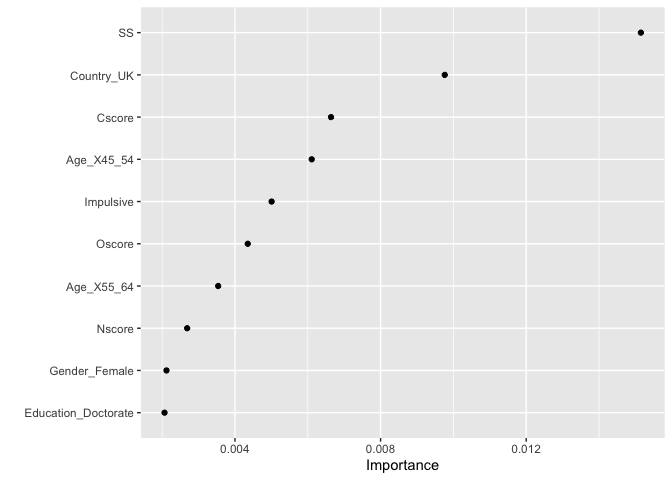

# Lucas de Paula

# Assignment 3 - Random Forest

 

``` r
library(tidyverse)
library(tidymodels)
library(caret)
library(gridExtra)
library(vip)
library(ranger)
library(skimr)
```

 

 

 

## Task 1: Check for missing data in our “drug\_clean” dataframe. Is there any missingness? If so, identify and implement a reasonable strategy to deal with the missingness.

 

``` r
skim(drug_clean)
```

|                                                  |             |
|:-------------------------------------------------|:------------|
| Name                                             | drug\_clean |
| Number of rows                                   | 1885        |
| Number of columns                                | 13          |
| \_\_\_\_\_\_\_\_\_\_\_\_\_\_\_\_\_\_\_\_\_\_\_   |             |
| Column type frequency:                           |             |
| factor                                           | 6           |
| numeric                                          | 7           |
| \_\_\_\_\_\_\_\_\_\_\_\_\_\_\_\_\_\_\_\_\_\_\_\_ |             |
| Group variables                                  | None        |

Data summary

**Variable type: factor**

| skim\_variable | n\_missing | complete\_rate | ordered | n\_unique | top\_counts                                |
|:---------------|-----------:|---------------:|:--------|----------:|:-------------------------------------------|
| Age            |          0 |              1 | FALSE   |         6 | 18\_: 643, 25\_: 481, 35\_: 356, 45\_: 294 |
| Gender         |          0 |              1 | FALSE   |         2 | Mal: 943, Fem: 942                         |
| Education      |          0 |              1 | FALSE   |         9 | Som: 506, Bac: 480, Mas: 283, Pro: 270     |
| Country        |          0 |              1 | FALSE   |         7 | UK: 1044, USA: 557, Oth: 118, Can: 87      |
| Ethnicity      |          0 |              1 | FALSE   |         7 | Whi: 1720, Oth: 63, Bla: 33, Asi: 26       |
| Nicotine       |          0 |              1 | FALSE   |         2 | Yes: 1264, No: 621                         |

**Variable type: numeric**

| skim\_variable | n\_missing | complete\_rate | mean |   sd |    p0 |   p25 |   p50 |  p75 | p100 | hist  |
|:---------------|-----------:|---------------:|-----:|-----:|------:|------:|------:|-----:|-----:|:------|
| Nscore         |          0 |              1 | 0.00 | 1.00 | -3.46 | -0.68 |  0.04 | 0.63 | 3.27 | ▁▃▇▅▁ |
| Escore         |          0 |              1 | 0.00 | 1.00 | -3.27 | -0.70 |  0.00 | 0.64 | 3.27 | ▁▃▇▃▁ |
| Oscore         |          0 |              1 | 0.00 | 1.00 | -3.27 | -0.72 | -0.02 | 0.72 | 2.90 | ▁▃▇▆▁ |
| Ascore         |          0 |              1 | 0.00 | 1.00 | -3.46 | -0.61 | -0.02 | 0.76 | 3.46 | ▁▃▇▃▁ |
| Cscore         |          0 |              1 | 0.00 | 1.00 | -3.46 | -0.65 | -0.01 | 0.58 | 3.46 | ▁▃▇▃▁ |
| Impulsive      |          0 |              1 | 0.01 | 0.95 | -2.56 | -0.71 | -0.22 | 0.53 | 2.90 | ▁▆▇▃▁ |
| SS             |          0 |              1 | 0.00 | 0.96 | -2.08 | -0.53 |  0.08 | 0.77 | 1.92 | ▂▇▇▇▅ |

 

There is no missing data on our dataset

 

## Task 2: Split the dataset into training (70%) and testing (30%) sets. Use a set.seed of 1234. Stratify by the “Nicotine” variable.

 

``` r
set.seed(1233) 
drug_split = initial_split(drug_clean, prop = 0.7, strata = Nicotine)
train = training(drug_split)
test = testing(drug_split)
```

 

## Task 3: Create appropriate visualizations (12 in all) to examine the relationships between each variable and “Nicotine”. Use grid.arrange (from the gridExtra package) to organize these visuals (perhaps in groups of four visualizations?). Comment on the relationship between each variable and “Nicotine”.

 

``` r
p1 = ggplot(train, aes(x = Age, fill = Nicotine)) + geom_bar(position = "fill")
p2 = ggplot(train, aes(x = Gender, fill = Nicotine)) + geom_bar(position = "fill")
p3 = ggplot(train, aes(x = Education, fill = Nicotine)) + geom_bar(position = "fill")
p4 = ggplot(train, aes(x = Country, fill = Nicotine)) + geom_bar(position = "fill")
p5 = ggplot(train, aes(x = Ethnicity, fill = Nicotine)) + geom_bar(position = "fill")
grid.arrange(p1,p2,p3,p4, p5)
```

<!-- -->

 

Between the categorical variables, there seems to be a strong
correlation between Age and Nocotine consume - as the age increases,
nicotine usage decreases. There seems to be less nitotine consume in
black and asian communities compared to other ethnicities. and it seems
that males consume more nicotine than women.

 

``` r
p1 = ggplot(train, aes(x = Nicotine, y = Nscore)) + geom_boxplot()
p2 = ggplot(train, aes(x = Nicotine, y = Escore)) + geom_boxplot()
p3 = ggplot(train, aes(x = Nicotine, y = Oscore)) + geom_boxplot()
p4 = ggplot(train, aes(x = Nicotine, y = Ascore)) + geom_boxplot()
grid.arrange(p1,p2,p3,p4)
```

<!-- -->

 

``` r
p1 = ggplot(train, aes(x = Nicotine, y = Cscore)) + geom_boxplot()
p2 = ggplot(train, aes(x = Nicotine, y = Impulsive)) + geom_boxplot()
p3 = ggplot(train, aes(x = Nicotine, y = SS)) + geom_boxplot()
grid.arrange(p1,p2,p3, ncol = 2)
```

<!-- -->

 

When it comes to numerical variables, there isn’t much to be seen when
comparing them against Nitocine. Maybe the most expressive difference is
in the SS (sensation seeking) variable - where it is higher, on average,
for those that consume nicotine than for those that don’t.

 

## Task 4: Create a random forest model on the training set to predict Nicotine using all of the variables in thedataset. You 5-fold, k-fold cross-validation (random number seed of 123 for the folds). Allow R to select mtry values between 2 and 8 and min\_n values between 5 and 20. Use 10 levels in your “grid\_regular” function.Set a random number seed of 123 for the tune\_grid function. Use 100 trees.Visualize the relationships between parameters and performance metrics.

 

``` r
set.seed(123)
rf_folds = vfold_cv(train, v = 5)

drug_recipe = recipe(Nicotine ~., train) %>%
  step_dummy(all_nominal(), -all_outcomes())

rf_model = rand_forest(mtry = tune() , min_n = tune(), trees = 100) %>% 
  set_engine("ranger", importance = "permutation") %>% 
  set_mode("classification")

drug_wflow = 
  workflow() %>% 
  add_model(rf_model) %>% 
  add_recipe(drug_recipe)

rf_grid = grid_regular(
  mtry(range = c(2, 8)), 
  min_n(range = c(5, 20)),
  levels = 10
)

set.seed(123)
rf_res_tuned = tune_grid(
  drug_wflow,
  resamples = rf_folds,
  grid = rf_grid
)
```

 

``` r
rf_res_tuned %>%
  collect_metrics() %>%
  filter(.metric == "accuracy") %>%
  select(mean, min_n, mtry) %>%
  pivot_longer(min_n:mtry,
    values_to = "value",
    names_to = "parameter"
  ) %>%
  ggplot(aes(value, mean, color = parameter)) +
  geom_point(show.legend = FALSE) +
  facet_wrap(~parameter, scales = "free_x") +
  labs(x = NULL, y = "Accuracy")
```

<!-- -->

 

## Task 5: Use the best mtry and min\_n values from Task 4 to finalize the workflow and fit the model to training set. Examine variable importance. What variables are most important in this model? (Hint: Referback to the dataset’s webpage if you need clarification as to meaning of any variables).

 

``` r
best_rf = select_best(rf_res_tuned, "accuracy")

final_rf = finalize_workflow(
  drug_wflow,
  best_rf
)

final_rf
```

    ## ══ Workflow ════════════════════════════════════════════════════════════════════
    ## Preprocessor: Recipe
    ## Model: rand_forest()
    ## 
    ## ── Preprocessor ────────────────────────────────────────────────────────────────
    ## 1 Recipe Step
    ## 
    ## • step_dummy()
    ## 
    ## ── Model ───────────────────────────────────────────────────────────────────────
    ## Random Forest Model Specification (classification)
    ## 
    ## Main Arguments:
    ##   mtry = 3
    ##   trees = 100
    ##   min_n = 15
    ## 
    ## Engine-Specific Arguments:
    ##   importance = permutation
    ## 
    ## Computational engine: ranger

 

``` r
final_rf_fit = fit(final_rf, train)

final_rf_fit %>% pull_workflow_fit() %>% vip(geom = "point")
```

<!-- -->

 

The most important varables on the dataset are: SS (sensation seeking),
Cscore (Conscientiousness), Country UK and Oscore (Openness to
experience).

 

## Task 6: How does the model perform on the training and testing sets?

 

``` r
# Training

trainpredrf = predict(final_rf_fit, train)
head(trainpredrf)
```

    ## # A tibble: 6 x 1
    ##   .pred_class
    ##   <fct>      
    ## 1 No         
    ## 2 No         
    ## 3 No         
    ## 4 Yes        
    ## 5 No         
    ## 6 Yes

``` r
confusionMatrix(trainpredrf$.pred_class, train$Nicotine, 
                positive = "Yes")
```

    ## Confusion Matrix and Statistics
    ## 
    ##           Reference
    ## Prediction Yes  No
    ##        Yes 864 159
    ##        No   20 275
    ##                                           
    ##                Accuracy : 0.8642          
    ##                  95% CI : (0.8445, 0.8822)
    ##     No Information Rate : 0.6707          
    ##     P-Value [Acc > NIR] : < 2.2e-16       
    ##                                           
    ##                   Kappa : 0.6652          
    ##                                           
    ##  Mcnemar's Test P-Value : < 2.2e-16       
    ##                                           
    ##             Sensitivity : 0.9774          
    ##             Specificity : 0.6336          
    ##          Pos Pred Value : 0.8446          
    ##          Neg Pred Value : 0.9322          
    ##              Prevalence : 0.6707          
    ##          Detection Rate : 0.6555          
    ##    Detection Prevalence : 0.7762          
    ##       Balanced Accuracy : 0.8055          
    ##                                           
    ##        'Positive' Class : Yes             
    ## 

 

``` r
# Testing

testpredrf = predict(final_rf_fit, test)
head(testpredrf)
```

    ## # A tibble: 6 x 1
    ##   .pred_class
    ##   <fct>      
    ## 1 Yes        
    ## 2 No         
    ## 3 No         
    ## 4 Yes        
    ## 5 No         
    ## 6 Yes

``` r
confusionMatrix(testpredrf$.pred_class, test$Nicotine, 
                positive = "Yes")
```

    ## Confusion Matrix and Statistics
    ## 
    ##           Reference
    ## Prediction Yes  No
    ##        Yes 343 131
    ##        No   37  56
    ##                                          
    ##                Accuracy : 0.7037         
    ##                  95% CI : (0.6642, 0.741)
    ##     No Information Rate : 0.6702         
    ##     P-Value [Acc > NIR] : 0.04826        
    ##                                          
    ##                   Kappa : 0.2317         
    ##                                          
    ##  Mcnemar's Test P-Value : 7.225e-13      
    ##                                          
    ##             Sensitivity : 0.9026         
    ##             Specificity : 0.2995         
    ##          Pos Pred Value : 0.7236         
    ##          Neg Pred Value : 0.6022         
    ##              Prevalence : 0.6702         
    ##          Detection Rate : 0.6049         
    ##    Detection Prevalence : 0.8360         
    ##       Balanced Accuracy : 0.6010         
    ##                                          
    ##        'Positive' Class : Yes            
    ## 

 

The model has an accuracy of 0.9188 on the training dataset and 0.7143
on the testing dataset - which is a big difference in performance. This
model is not good at generalizing. I think a hint that the model is not
good is to compare the variable importance graph against the initial
exploration we had done. The variables we thought were going to impact
the model performance were not used in the model. One thing we could do
to try to improve the model is to add those variables to the model by
forcing it.

 

## Task 7: Comment on how this model might be used in the “real-world.” Would you recommend this modelfor real-world use? What if any concerns would you have about using the model?

 

This model could be used to have a high level understanding of the
factors that might lead someone to try nicotine or become a user. Our
model, as it selected fewer variables, doesn’t generalize well and could
potentially be better if we kept different variables such as other types
of drugs. That could help us understand if a more serious problem could
arise in society due to the fact that someone has an inclination to move
towards other drugs. I would not use this model to make specific
recommendations or deny/allow service to a person as the accuracy and
other metrics of the model make me believe it is not a accurate model
and relies on a few variables to make its predictions.
