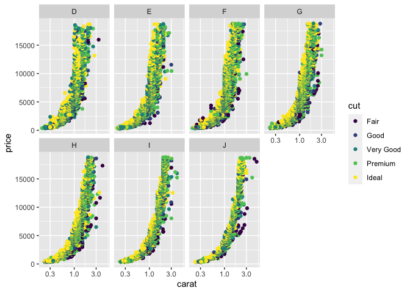

``` r
library(tidyverse)
```

``` r
diamonddata <- diamonds

nrow(diamonddata)
```

    ## [1] 53940

``` r
ncol(diamonddata)
```

    ## [1] 10

The diamonds dataset contains 53940 rows and 10 columns.

``` r
ggplot(diamonddata, aes(x = carat, y = price)) + 
  geom_point() + 
  scale_x_log10()
```

<!-- -->

The plot shows a positive correlation between carat and price, basically
as the carat number increases, the price increases. Meaning the better
the quality, the pricier it is.

``` r
ggplot(diamonddata, aes(x = carat, y = price, color = cut)) + 
  geom_point() + 
  scale_x_log10()
```

<!-- -->

The distribution looks the same, but taking the cut of the diamonds into
consideration, usually the fair condition diamond is usually in the
lower range of the prices in each carat category, and the ideal/premium
cuts are usually in the higher end in each carat category.

``` r
ggplot(diamonddata, aes(x = carat, y = price, color = cut)) + 
  geom_point() + 
  facet_wrap(~ color, ncol=4) + 
  scale_x_log10()
```

<!-- -->

The color of the diamond goes from D (best) to J (worst). The price
distribution doesn’t change much by color, but the cut does. We can see
that for distribution D it is more between Premium/Ideal, while for J it
contains more Fair cuts , meaning less quality diamonds.

``` r
inventory <- read_csv("data/InventoryData.csv")
```

    ## 
    ## ── Column specification ────────────────────────────────────────────────────────
    ## cols(
    ##   `Item SKU` = col_character(),
    ##   Store = col_character(),
    ##   Supplier = col_character(),
    ##   `Cost per Unit ($)` = col_double(),
    ##   `On Hand` = col_double(),
    ##   `Annual Demand` = col_double()
    ## )

``` r
inventory
```

    ## # A tibble: 13,561 x 6
    ##    `Item SKU` Store  Supplier `Cost per Unit ($)` `On Hand` `Annual Demand`
    ##    <chr>      <chr>  <chr>                  <dbl>     <dbl>           <dbl>
    ##  1 0100       003480 A                     125.         159            1693
    ##  2 0100       01611  B                     115.          40             351
    ##  3 0100       01611  D                      53.6        174            1691
    ##  4 0100       020109 B                       2.26       176            1559
    ##  5 0100       020109 C                      60.5         74             733
    ##  6 0100       020109 D                      53.7         48             496
    ##  7 0100       080212 B                     107.           6              58
    ##  8 011        003480 B                       1.33       129            1106
    ##  9 011        003480 C                      12.9         82             771
    ## 10 011        01611  C                       5.16        17             172
    ## # … with 13,551 more rows

``` r
inventoryA <- inventory %>%
  filter(Supplier == "A")

nrow(inventoryA)
```

    ## [1] 3695

There are 3695 rows on inventoryA

``` r
inventoryA = mutate(inventoryA, OnHandRatio =`On Hand`/`Annual Demand`)

inventoryA
```

    ## # A tibble: 3,695 x 7
    ##    `Item SKU` Store  Supplier `Cost per Unit ($)` `On Hand` `Annual Demand`
    ##    <chr>      <chr>  <chr>                  <dbl>     <dbl>           <dbl>
    ##  1 0100       003480 A                     125.         159            1693
    ##  2 011        020109 A                      12.3        173            1695
    ##  3 0113       031779 A                     208.         166            1496
    ##  4 0113       080212 A                     187.         157            1654
    ##  5 0122       003480 A                      68.5         34             290
    ##  6 0122       020109 A                     120.          77             680
    ##  7 0122       031779 A                      56.6        133            1239
    ##  8 013        003480 A                      19.1         28             277
    ##  9 013        020109 A                      22.7        103             962
    ## 10 013        031779 A                       1.13        29             297
    ## # … with 3,685 more rows, and 1 more variable: OnHandRatio <dbl>

This step creates a new column called OnHandRatio that divides the
values of On Hand by Annual Demand.

``` r
avg_cost <- inventory %>%
  group_by(`Item SKU`) %>%
  summarize(SKUAvgCost = mean(`Cost per Unit ($)`))

avg_cost
```

    ## # A tibble: 1,817 x 2
    ##    `Item SKU` SKUAvgCost
    ##    <chr>           <dbl>
    ##  1 0100             73.9
    ##  2 011              10.2
    ##  3 0113            164. 
    ##  4 0122            105. 
    ##  5 013              17.6
    ##  6 0133            142. 
    ##  7 0137            166. 
    ##  8 014              11.2
    ##  9 0151            155. 
    ## 10 0152            192. 
    ## # … with 1,807 more rows

These courses haven’t been super challenging to me, but one feedback
that I gave to Prof. Cummings was to add more real world data to treat
data in a ETL type of job, and learn more advanced automation ways of
creating analysis. I feel that most courses focus on ad-hoc analyses.
